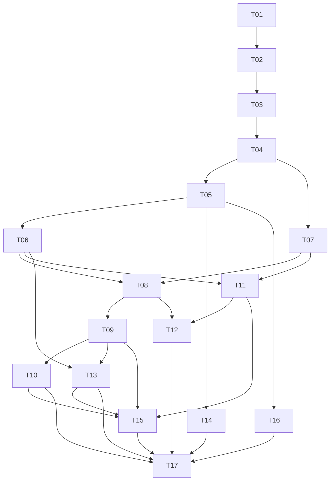

# LoreWeave v1 GitHub issue map

The [specification issue](https://github.com/L-1ngg/loreweave/issues/1) owns product acceptance outcomes. The
[module map](../../docs/design/rag-v1/README.md) owns responsibilities and
interfaces. These 17 work items are vertical delivery slices selected under the
user's routine-design/decomposition delegation on 2026-09-10.

At migration on 2026-09-10, all tickets were scoped as `ready-for-agent` and none
was implemented. GitHub Issues own current status, blockers and acceptance evidence;
this file is a navigation map. Local spec/ticket files are historical snapshots.
Implementation still starts from an explicit execution request. A readiness
label is neither user acceptance of measured quality nor a request to run tools
against production. The initial starting frontier is [work item 01](https://github.com/L-1ngg/loreweave/issues/2).
Check live dependencies before starting later work.

## Dependency map

| Work item | Blocked by | Modules touched |
| --- | --- | --- |
| [01 Run a bounded evidence-tool turn in the browser](https://github.com/L-1ngg/loreweave/issues/2) | None | M07, M06, M09 |
| [02 Persist conversations and settle cancellation correctly](https://github.com/L-1ngg/loreweave/issues/3) | [#2](https://github.com/L-1ngg/loreweave/issues/2) | M07, M08, M09 |
| [03 Apply organization access and project scope to knowledge operations](https://github.com/L-1ngg/loreweave/issues/4) | [#3](https://github.com/L-1ngg/loreweave/issues/3) | M01, M07, M09 |
| [04 Import Markdown and inspect versioned original passages](https://github.com/L-1ngg/loreweave/issues/5) | [#4](https://github.com/L-1ngg/loreweave/issues/4) | M02, M08, M09 |
| [05 Answer fact questions from hybrid original-source retrieval](https://github.com/L-1ngg/loreweave/issues/6) | [#5](https://github.com/L-1ngg/loreweave/issues/5) | M02, M06, M07, M09 |
| [06 Update a document and switch current evidence atomically](https://github.com/L-1ngg/loreweave/issues/7) | [#6](https://github.com/L-1ngg/loreweave/issues/6) | M02, M06, M08, M09 |
| [07 Resolve entity identities with inspectable source evidence](https://github.com/L-1ngg/loreweave/issues/8) | [#5](https://github.com/L-1ngg/loreweave/issues/5) | M02, M03, M08, M09 |
| [08 Publish cited cross-document topic Wiki pages](https://github.com/L-1ngg/loreweave/issues/9) | [#7](https://github.com/L-1ngg/loreweave/issues/7), [#8](https://github.com/L-1ngg/loreweave/issues/8) | M02, M03, M05, M06, M08, M09 |
| [09 Refresh Wiki after source changes and natural-language corrections](https://github.com/L-1ngg/loreweave/issues/10) | [#9](https://github.com/L-1ngg/loreweave/issues/9) | M02, M03, M05, M06, M08, M09 |
| [10 Merge, split and restore Wiki pages with traceable navigation](https://github.com/L-1ngg/loreweave/issues/11) | [#10](https://github.com/L-1ngg/loreweave/issues/10) | M05, M06, M08, M09 |
| [11 Retrieve source-backed qualified graph relationships](https://github.com/L-1ngg/loreweave/issues/12) | [#7](https://github.com/L-1ngg/loreweave/issues/7), [#8](https://github.com/L-1ngg/loreweave/issues/8) | M02, M03, M04, M06, M08, M09 |
| [12 Answer multi-hop questions with bounded adaptive retrieval](https://github.com/L-1ngg/loreweave/issues/13) | [#9](https://github.com/L-1ngg/loreweave/issues/9), [#12](https://github.com/L-1ngg/loreweave/issues/12) | M03, M04, M05, M06, M07, M09 |
| [13 Resolve natural-language source and Wiki requests across turns](https://github.com/L-1ngg/loreweave/issues/14) | [#7](https://github.com/L-1ngg/loreweave/issues/7), [#10](https://github.com/L-1ngg/loreweave/issues/10) | M01, M02, M05, M07, M08, M09 |
| [14 Expose organization-scoped evidence and answers through MCP](https://github.com/L-1ngg/loreweave/issues/15) | [#6](https://github.com/L-1ngg/loreweave/issues/6) | M01, M06, M07, M09 |
| [15 Recover interrupted maintenance without duplicate or stale effects](https://github.com/L-1ngg/loreweave/issues/16) | [#10](https://github.com/L-1ngg/loreweave/issues/10), [#11](https://github.com/L-1ngg/loreweave/issues/11), [#12](https://github.com/L-1ngg/loreweave/issues/12), [#14](https://github.com/L-1ngg/loreweave/issues/14) | M02, M03, M04, M05, M07, M08, M09 |
| [16 Build reproducible evaluation over public answer interfaces](https://github.com/L-1ngg/loreweave/issues/17) | [#6](https://github.com/L-1ngg/loreweave/issues/6) | M06, M09 |
| [17 Run acceptance and capacity comparisons on a frozen corpus](https://github.com/L-1ngg/loreweave/issues/18) | [#11](https://github.com/L-1ngg/loreweave/issues/11), [#13](https://github.com/L-1ngg/loreweave/issues/13), [#14](https://github.com/L-1ngg/loreweave/issues/14), [#15](https://github.com/L-1ngg/loreweave/issues/15), [#16](https://github.com/L-1ngg/loreweave/issues/16), [#17](https://github.com/L-1ngg/loreweave/issues/17) | M01, M02, M03, M04, M05, M06, M07, M08, M09 |

The DAG expresses actual prerequisites, not a required single serial order.
After 04, identity work (07) can progress alongside retrieval/update work (05/06).
After 06/07, Wiki (08) and graph (11) have independent implementation paths.
MCP access (14) and the evaluation harness (16) need only source answering (05).
Combined multi-hop behavior (12) integrates the two knowledge routes.

## How to refine and implement

Review the common invariants before polishing a module in isolation. Start with
Sources' activation contract (M02), Evidence's final admission/finalization
contract (M06), and Agent Host's settlement/budget contract (M07); these determine
most cross-module behavior. Then inspect identity and Wiki/graph publication.

For implementation, select a ticket whose blockers are complete, read its
acceptance boundary and the linked module contracts, and use a fresh context for
that bounded task. Keep shared state changes sequential within their owners.
Add implementation-specific paths only once they exist; this plan specifies
behavior rather than assuming today's source layout.

Each ticket must demonstrate an end-to-end behavior, including the relevant
transport/view and persistence where introduced by that slice. Early development
fixtures are explicitly identified; later production-capable slices must replace
them at the same interfaces. The final assessment uses a frozen corpus and real
configured providers; it cannot be completed merely by replaying fixture tests.

## Scope and evidence

Routine granularity and dependencies are decided under Q36/Q39, so no repeated
ticket approval is required. Changes to confirmed product behavior must be
visible in the specification and discussion record. Upstream Forge issues remain
separate from this LoreWeave backlog.

No product tests were run for this document change. Document links, acceptance
coverage and dependency structure are checked separately; executed ticket evidence
belongs in that GitHub issue's Evidence section.
