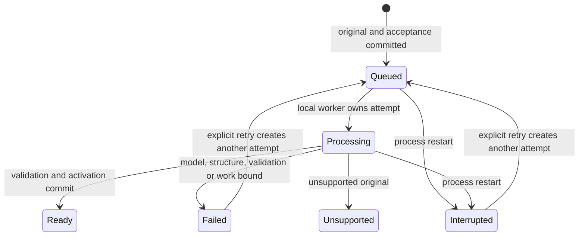

# PDF indexing

[indexing.ts](../../src/server/indexing.ts) processes accepted sources with one
bounded local worker. [Contracts](contracts.md#m03-pdf-indexing) define retry and
publication. Both modes use the same extracted pages and default navigation
summaries; selection defaults to Flash and never switches automatically.

## Extraction and original evidence

[pdf-engine.ts](../../src/server/pdf-engine.ts) uses PDF.js for text items,
geometry, fonts, rotation, outlines and printed labels. Immutable PDF bytes are
retained independently of extraction. Stored physical pages include readable
original text and structural inputs for indexing.

Reading order comes from lines and detected columns rather than a global text-item
sort. Chinese/English joining, rotation and recurring margins have fixture checks.
Margin cleanup affects navigation/heading input; original factual text retains
headers, footers and qualifications. Verified bookmarks can guide structure;
bookmarks alone do not establish valid chapter locations. QA reads persisted
pages rather than reparsing the PDF.

Scanned or unreadable text layers, unsupported encryption and malformed inputs
produce explicit outcomes. Extracted pages alone do not make a source ready for QA.

## Flash

1. Infer headings from layout/font/style/numbering and fuse verified outlines.
2. Resolve hierarchy and inclusive physical-page ranges, including reachable front
   matter and valid shared boundaries.
3. Validate the candidate. Inadequate chapter structure fails explicitly; it is not
   replaced with a claimed successful page-only index.
4. Merge small nodes and use bounded model-assisted subdivision for oversized
   sections, verifying source-backed titles and locations.
5. Generate navigation summaries and validate/publish the final artifacts.

Initial construction in [trees.ts](../../src/server/trees.ts) makes no model calls.
Refinement and summaries in [refinement.ts](../../src/server/refinement.ts) use the
captured `index` role through TanStack AI. The product exposes no summary/refinement
toggle. An initial draft is inspectable preparation, not completed default indexing.

## Standard

[standard.ts](../../src/server/standard.ts) constructs structure with the captured
index model, independent of successful Flash inference.

With a usable printed TOC, bounded inspection extracts titles, hierarchy and
printed labels. Mapping verifies the actual physical headings, handling Roman
labels/front matter and numbering offsets. Invalid or ambiguous mappings receive
bounded repair or explicit failure. A model's proposed page number alone cannot
authorize publication.

Without a usable TOC, bounded original-body windows produce verified heading
candidates. The resulting hierarchy goes through refinement, subdivision,
summaries and the same publication checks. Construction uses the same
margin-filtered body used for anchor verification; complete stored original text
remains available for inspection and QA.

## Navigation summaries

Leaves summarize bounded original-page windows; sufficiently short text can be
reused directly. Parent reduction receives child/fragment summaries with their
physical bounds. Shared navigation coverage does not imply that different years'
facts occur on the same boundary page. Summaries retain mode/model/parser
provenance and are generated after refinement.

A failed required summary cannot be skipped to mark the index ready. Schema,
range and coverage validation cannot guarantee semantic entailment of arbitrary
summaries. They guide reading; factual conclusions still require original pages.
The [dated evaluation](../evaluation/pageindex-v1.md) records a measured boundary
summary defect, correction and remaining compression risk.

## Attempts and publication

Each attempt captures mode, model/connection revision, finite work bounds and
validated stage manifests. Progress identifies extraction, construction,
optimization, summaries and validation. The current retry path reuses extraction
only when its source/extractor/digest match; other stages run anew. Partial or
unvalidated output is not a completed reusable stage.

Activation in [library.ts](../../src/server/library.ts) checks operation/attempt/
version identity, expected library revision and retirement transactionally.
Updates keep their previous effective source until activation. Failure or an
obsolete completion cannot replace it or reactivate a retired item.

## Comparison boundary

[Frozen fixtures](../../tests/fixtures/pdf/manifest.json) cover columns, CJK,
rotation, outlines, printed TOC offsets, missing TOC, large/shared-boundary sections
and unsupported inputs. The isolated PageIndex Python reference is pinned by
[NOTICE](../../NOTICE.md) and used only for development evaluation. Accepted trees
require verified original anchors, valid bounds, complete physical coverage and
summaries. Exact Python hierarchy or node IDs are not parity requirements.
See [evaluation method](../development/evaluation.md) for ordering tolerances,
failure denominators and actual-provider verification.
