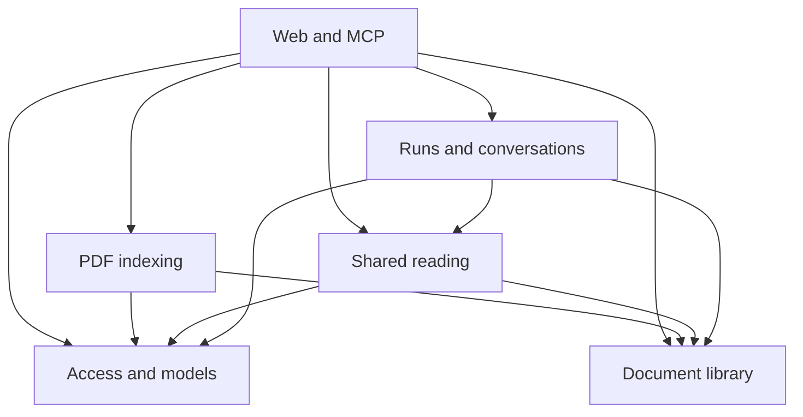

# Architecture

LoreWeave is a single-process TypeScript application running TanStack Start under
Bun, with React views and a PostgreSQL/Drizzle database. PDF originals are stored
on disk; extracted pages, indexes, conversation history and execution state are
persisted on the server. [ADR-0005](../adr/0005-pageindex-typescript-replacement.md)
records why this replaced the earlier knowledge-maintenance runtime.

## Modules and entry points

Modules are responsibility boundaries, not separate packages or services.

| Module                     | Owns                                                                                              | Main implementation                                                                                                                                                                                                               |
| -------------------------- | ------------------------------------------------------------------------------------------------- | --------------------------------------------------------------------------------------------------------------------------------------------------------------------------------------------------------------------------------- |
| M01 Access and models      | Owner sessions, MCP credentials, sealed connection revisions and role capture                     | [access.ts](../../src/server/access.ts), [models.ts](../../src/server/models.ts), [tokens.ts](../../src/server/tokens.ts), [secrets.ts](../../src/server/secrets.ts)                                                              |
| M02 Document library       | Documents, immutable sources, stored pages, published indexes and activation/retirement           | [library.ts](../../src/server/library.ts), [originals.ts](../../src/server/originals.ts), [upload.ts](../../src/server/upload.ts)                                                                                                 |
| M03 PDF indexing           | Extraction, Flash/Standard, refinement, summaries and attempt progress                            | [indexing.ts](../../src/server/indexing.ts), [pdf-engine.ts](../../src/server/pdf-engine.ts), [trees.ts](../../src/server/trees.ts), [standard.ts](../../src/server/standard.ts), [refinement.ts](../../src/server/refinement.ts) |
| M04 Shared reading         | Four scoped, bounded document/tree/page primitives and reference resolution                       | [reading.ts](../../src/server/reading.ts)                                                                                                                                                                                         |
| M05 Runs and conversations | Accepted questions, scope/version bindings, page reads, citations, canonical history and delivery | [knowledge.ts](../../src/server/knowledge.ts), [persistence.ts](../../src/server/persistence.ts), [runtime.ts](../../src/server/runtime.ts)                                                                                       |
| M06 Web and MCP            | Server functions, raw routes, React presentation and credential/transport adaptation              | [functions](../../src/functions/), [routes](../../src/routes/), [components](../../src/components/), [mcp.ts](../../src/server/mcp.ts)                                                                                            |

The reading agent invokes M04 directly in-process. The MCP adapter publishes those
same tools and adds independent `question_answer` through M05. It does not create
a second indexing/QA implementation or route internal tools through its own MCP
endpoint.

## Data and process ownership

[database.ts](../../src/server/database.ts), [schema.ts](../../src/server/schema.ts)
and [migrations](../../migrations/) define the independent PostgreSQL schema.
Original PDF bytes are durable before import acknowledgment. Activation publishes
validated source/index artifacts transactionally; old versions remain immutable.

PostgreSQL owns the authoritative transcript and run outcomes. Query caches
metadata, AI React presents messages, and an SDK memory log supports live delivery.
These client/delivery states do not replace server history. Accepted indexing and
question producers have process-owned lifetimes independent of browser requests.
Restart interrupts unfinished work without automatic execution replay.

[dev.ts](../../scripts/dev.ts) launches Vite under Bun;
[serve.ts](../../scripts/serve.ts) serves the compiled Start Fetch handler and
assets. There is no independent Hono or Python application runtime. Validation
and evaluation tools are development commands outside the product request path.

Read [contracts](contracts.md) for invariants, [indexing](indexing.md) for PDF work,
[runs and evidence](runs-and-evidence.md) for QA, and [Web/runtime](web-and-runtime.md)
for transport and cache ownership. [Testing](../development/testing.md) and the
[evaluation method](../development/evaluation.md) distinguish behavior checks from
measured model quality.
