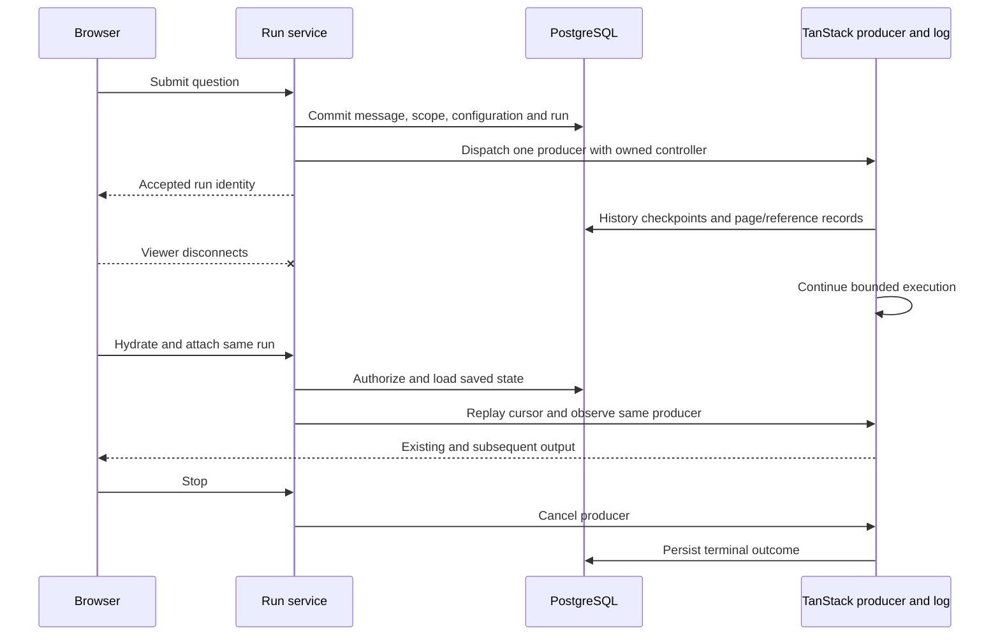

# Runs and evidence

[knowledge.ts](../../src/server/knowledge.ts) owns question acceptance, execution,
history, references and attachments. It composes the shared [reading service](../../src/server/reading.ts)
with TanStack AI and a [PostgreSQL persistence adapter](../../src/server/persistence.ts).
The [contracts](contracts.md#m05-runs-references-and-conversations) define the
observable guarantees.

## Acceptance and authoritative history

The server authenticates the owner, validates conversation/scope and coordinates
the conversation writer. It commits the user message, submission/run identity and
captured QA configuration before acknowledging acceptance and dispatching model
work. Repeating that submission attaches to existing work without another message
or execution. A deliberate resend creates a new run.

Model history comes from the authorized server transcript. Client messages cannot
replace that transcript. The TanStack MessageStore/RunStore adapter implements
the installed persistence contract, while application transactions protect
acceptance, one-writer state and final outcomes. Streaming snapshots are bounded
checkpoints; a process crash can lose output emitted since the last commit.
Completed history requires the final canonical result to be stored.

## Scope and version binding

Explicit selection is a nonempty server-enforced document allowlist, bound to
available source versions at acceptance. Omitted selection enables current-library
discovery. In library mode, the first substantive read pins a document's source;
metadata discovery does not permanently narrow future questions. Each new run
resolves current availability and scope again.

Every tool checks visibility, pinned versions and bounds. Short documents can be
read directly; documents longer than 20 pages require tree navigation first.
Mixed-length scope applies that prerequisite per document. Trees and summaries
help choose original pages and cannot support factual conclusions by themselves.
Continuation/truncation is explicit; bounded search cannot prove universal absence.

Follow-ups use canonical conversational context and new original reads. Prior
assistant answers are not independent evidence. Cache reuse still records the
physical-page read in the current run. Conflicting originals keep source/year/
scope distinctions; missing support yields an evidence gap or incomplete outcome.

## Reference issuance

Reading records bind run, document, source version and physical page before the
answer can cite them. Reference validation checks identity relationships, scope,
current authorization, original availability and recorded access. Handles cannot
invent pages or grant access. Answers use claim-adjacent Markdown citations that
open the bound immutable original. Page location validity is separate from
semantic claim support, which is [reviewed against originals](../development/evaluation.md).

Updates and retirement retain authorized historical references. New follow-up
reads still obey current scope/eligibility; historical access cannot silently
reintroduce a retired document to new QA.

## One producer and reconnecting observers

The installed AI core's `memoryStream`, `toServerSentEventsResponse` and
`resumeServerSentEventsResponse` provide delivery. The producer starts at dispatch,
including with zero observers. It owns a controller independent of browser
`Request.signal`. Raw Start routes return SDK responses; AI React displays stable
message/part identities, with Query supplying authorized metadata and hydration.

The process retains run controls and a bounded memory log. Finished logs have a
five-minute grace window and a 1,024-log pressure bound. After eviction or process
restart, PostgreSQL remains the recovery source. A missing log never triggers a
new model call; an inconsistent active run without a producer fails explicitly.
The attachment's first-output wait is finite. Intermediate tool-loop finish
events do not necessarily mean the entire producer has completed.

## Stop and interruption

Stop records cancellation intent, updates the SDK run and aborts the owned
controller with `RUN_CANCEL_REASON`. Viewer disconnection only detaches.
Completed, failed, stopped and interrupted remain distinct product outcomes.
Local transport abort cannot establish provider-side computation or billing
termination.

[runtime.ts](../../src/server/runtime.ts) marks unfinished work interrupted on
startup, keeps committed history and clears authoritative active-writer state.
It does not replay models. Deletion remains blocked during queued/running/stopping
work; a terminal outcome permits deletion without removing document originals.

## Independent MCP questions

Each `question_answer` invocation uses its token-authorized scope, captured QA
role, four reading primitives and the same evidence contract. It has no Web
conversation or shared history between invocations. The MCP protocol's call
cancellation is supplied to this independent run; Web reconnect behavior does
not add an MCP subscription product. Standalone reading tools/resources make no
QA model calls, and the internal agent never recursively invokes `question_answer`.
