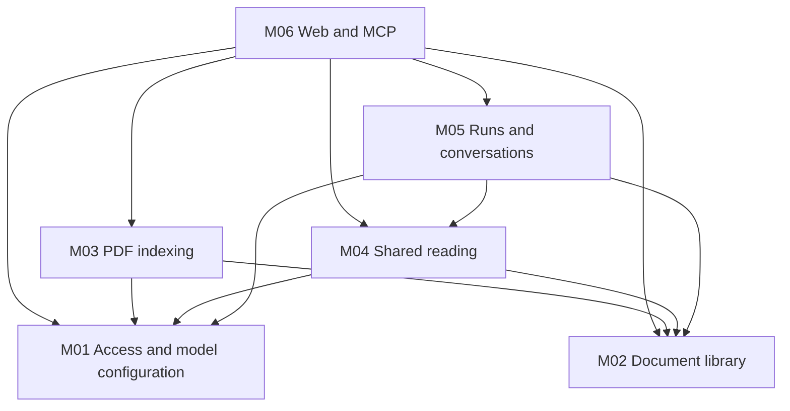

# PageIndex v1 Construction Modules

Status: implemented and locally verified module boundaries, 2026-10-01.
#30-#47 have execution evidence. The [final matrix](../../evaluation/pageindex-acceptance.md)
and [measured evaluation](../../evaluation/pageindex-results.md) record integrated
acceptance and practical limitations.
[Spec #29](https://github.com/L-1ngg/loreweave/issues/29) owns product scope.
[The blueprint](../../pageindex-v1-blueprint.md) owns construction navigation.
[Shared contracts](contracts.md) own the interfaces and state invariants below.

## Module map

| ID  | Module                           | Small interface                                                                    | Owns                                                                                               |
| --- | -------------------------------- | ---------------------------------------------------------------------------------- | -------------------------------------------------------------------------------------------------- |
| M01 | Access and model configuration   | Authenticate, authorize capability, manage settings, capture model role            | Sole owner, sessions, token verification, connection revisions and role defaults                   |
| M02 | Document library                 | Accept source, inspect document, resolve immutable page/original, activate, retire | Documents, versions, source bytes, page/index artifacts and effective pointer                      |
| M03 | PDF indexing                     | Execute selected attempt, inspect progress, retry                                  | Extraction, Flash/Standard, optimization/summaries, attempt state and stage compatibility          |
| M04 | Shared document reading          | Browse metadata, read document/tree/pages                                          | Four tool definitions, scope-aware reads, pagination and page-read results                         |
| M05 | Knowledge runs and conversations | Accept question, observe/stop run, manage history                                  | TanStack loop integration, run scope/version binding, evidence/reference records and conversations |
| M06 | Web and MCP interfaces           | HTTP commands/queries, original viewer and MCP transport                           | Request/response schemas, credential-to-context adaptation, React views and protocol delivery      |

Modules are responsibilities behind small interfaces. They are not six packages
or six processes. SQL adapters, PDF.js, model adapters and artifact storage stay
behind the modules that use them. The composition root supplies one database
client, artifact store and the selected SDK adapters.

## Implemented entry points

| Module | Runtime files |
| --- | --- |
| M01 | `src/server/access.ts`, `models.ts`, `tokens.ts`, `secrets.ts` |
| M02 | `src/server/library.ts`, `originals.ts`, `upload.ts` |
| M03 | `src/server/indexing.ts`, `pdf-engine.ts`, `trees.ts`, `standard.ts`, `refinement.ts`, `index-model.ts` |
| M04 | `src/server/reading.ts` (one shared four-tool surface) |
| M05 | `src/server/knowledge.ts`, `persistence.ts`, `runtime.ts` |
| M06 | `src/functions/`, `src/routes/`, `src/components/`, `src/server/mcp.ts` |

`migrations/0001` through `0006` provision the independent PostgreSQL schema.
The compiled composition is the Start Fetch handler in `scripts/serve.ts`;
`scripts/dev.ts` invokes Vite explicitly under Bun. Validation/evaluation scripts
are development commands and never become a second application runtime.

## Dependencies

M02 provides the acceptance transaction and artifact publication interface; M03
supplies work outcomes rather than writing M02's tables directly. M04 returns
authorized page/read data to M05; M05 records it under its run before issuing a
citation handle. This keeps document access reusable for standalone MCP readers
without making every read a Web conversation.

M06 translates transports and UI actions. It does not own a second indexing or
QA implementation. The internal Agent's tool set contains only M04's four
primitives; the external question_answer adapter calls M05 directly.

M06 uses TanStack Start/React, Router, Query, Form and AI React. The
[Web/runtime integration](frontend-and-runtime.md) owns framework responsibilities,
server-function/raw-route selection, cache/transcript boundaries, Intent and
Bun compatibility gates. Domain modules keep their interfaces independent of
UI libraries; Start replaces the default independent Hono entry.

## Read by change

| Change                                                 | Read                                                                                                                                             |
| ------------------------------------------------------ | ------------------------------------------------------------------------------------------------------------------------------------------------ |
| Owner authentication, tokens, model roles              | M01 in [contracts](contracts.md)                                                                                                                 |
| Upload/update/retirement, originals and references     | M02 and common invariants in [contracts](contracts.md)                                                                                           |
| PDF extraction, either mode, retry                     | M03 in [contracts](contracts.md), then [indexing](indexing.md)                                                                                   |
| Tool parameters, scope, pagination or historical reads | M04 in [contracts](contracts.md), then [QA](qa-and-streams.md)                                                                                   |
| New questions, evidence, history, Stop or reattachment | M05 in [contracts](contracts.md), then [QA](qa-and-streams.md)                                                                                   |
| Browser/API/MCP behavior                               | M06 and target HTTP surface in [contracts](contracts.md), [Web/runtime integration](frontend-and-runtime.md), plus the affected product workflow |
| Starting implementation                                | The selected live GitHub work item and its completed blockers; [ticket plan](tickets/README.md) is initially a publication draft                 |

## Authority

| Document                                 | Authority                                                      |
| ---------------------------------------- | -------------------------------------------------------------- |
| Spec #29                                 | Confirmed product behavior and AC01-AC35                       |
| CONTEXT.md                               | One current domain glossary                                    |
| ADR-0005                                 | Replacement choice and rationale                               |
| Module/shared contracts                  | Interface meaning, ownership, failure and transaction rules    |
| Web/runtime integration                  | TanStack adoption, transport/cache boundaries and Intent gates |
| Blueprint                                | Architecture overview and construction order                   |
| Live GitHub work items                   | Executable slices, actual blockers, status and evidence        |
| Local ticket drafts                      | Review/publication input only; not implementation status       |
| Previous RAG documents and Issues #1-#28 | Historical behavior and provenance                             |

The new design replaces the earlier nine-module model. Source references,
source activation and bounded knowledge requests retain their source-grounded
meanings; active Wiki/graph/entity/organization responsibilities are retired.
