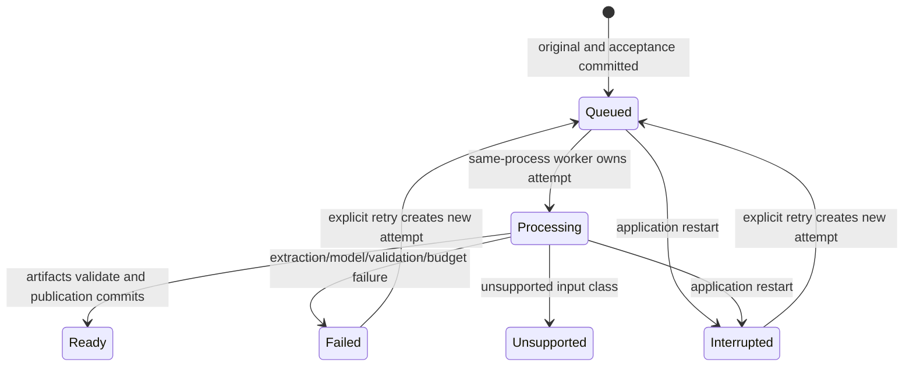

# PDF Extraction and Indexing Design

Status: target design, 2026-10-01. Read M02/M03 in [shared contracts](contracts.md)
for ownership and publication rules. The implementation reference is PageIndex
revision d2693d80791a86345ef78b3234834f5fe53a70a0. Retain attributable licensing
and record deviations; internal Python classes and exact node IDs are not TS
compatibility requirements.

## Shared extraction artifacts

Use a proven PDF engine for bytes, page count, text items, fonts, transforms,
embedded outlines and page labels. Start with pdfjs-dist and verify its supported
Bun path, including required worker/assets, before adopting it. Rotation and PDF
coordinate transforms use the engine's structured geometry facilities.

Store each source version's original PDF independently of derived extraction.
Preserve physical page number, printed label, raw text items/positions needed
for structural analysis, and a readable original-page representation. Keep
normalization/layout decisions in provenance. Navigation cleanup must not erase
qualifications from the original evidence or alter its physical-page binding.

Derive reading order from lines/blocks and detected column regions, not a global
sort of all text items. Inspect spacing, baseline, font and layout information;
handle Chinese/English token joining without inventing sentence content. Detect
recurrent margin headers/footers for navigation separately from source evidence.
Bookmarks are useful structure candidates, not automatically trusted authority.

The extraction interface exposes physical pages and structural inputs to both
indexing routes. The routes do not maintain two divergent original-page texts.
Normal QA reads persisted page artifacts instead of reparsing the source.

## Flash route

1. Build deterministic heading candidates from page layout, font/style statistics
   and numbering patterns. Validate outline locations and fuse trustworthy
   bookmarks with layout-derived candidates.
2. Resolve heading hierarchy and physical-page spans. Complement omitted front
   matter, reference sections and other reachable pages without inventing a
   chapter for every page. Preserve valid same-page section boundaries.
3. Normalize the initial tree and preserve merged headings as navigation metadata.
   Reject inadequate structural extraction explicitly; a long page-only fallback
   is not a successful chapter index.
4. Apply full optimization: deterministic small-node merging and bounded
   model-assisted subdivision of oversized sections using their original pages.
   Verify resulting titles, hierarchy and ranges before replacing a candidate.
5. Generate summaries from the finalized tree, then validate and publish the
   complete artifacts through M02.

Initial Flash hierarchy construction does not call a model. Optimization and
summaries use the captured index role through TanStack AI. Split thresholds and
layout heuristics are measured implementation defaults; no summary/optimization
toggle is exposed and no failure automatically switches to Standard.

Ticket P05 demonstrates an inspectable initial tree before model refinement.
That draft is not advertised as the completed default Flash index. P06 owns the
full optimized/summarized publication path required for final readiness.

## Standard route

Standard constructs a tree with the captured index model. It is not a repair
adapter for Flash and does not depend on successful Flash structural inference.

### Printed table of contents

Detect and extract table-of-contents content with bounded page inspection.
Parse titles/hierarchy/printed page labels into structured candidates. Resolve
printed labels to physical pages with original-page verification, including
front matter and changing numbering offsets. A model's page number alone is
not an accepted location.

Check candidate headings against their original pages and repair only within
bounded verified evidence. Build inclusive ranges, retain shared boundaries and
ensure pages omitted from the printed table remain reachable. Invalid labels,
duplicate/ambiguous mappings or inconsistent hierarchy produce visible bounded
repair/failure outcomes rather than unchecked publication.

### No usable printed table of contents

Extract headings/structure from bounded original-page windows. Combine those
candidates into a hierarchy and verify their page locations against original
content. Printed page labels remain metadata even when they are not useful for
construction. Subdivide oversized sections recursively within explicit depth,
call, page/context and elapsed-work bounds.

Construction/subdivision prompts use the same original body text used to verify
anchors, omitting detected repeated margins. Full page artifacts still retain
those margins for original inspection and factual reading. Parent summary inputs
retain the child/fragment physical ranges, and overlapping navigation ranges do
not imply that a fact occurs on every page or on their shared boundary.

Both Standard paths use typed/schema-validated TanStack outputs and application
range/coverage validation. They finish with default navigation summaries and
the same M02 publication contract. A no-TOC document is not routed through a
Flash fallback. P07 establishes the printed-TOC vertical path; P08 completes
no-TOC, subdivision and mapping edge cases before Standard-wide acceptance.

## Navigation summaries

Summarize a leaf from its original-page range. A sufficiently short leaf can
reuse its original text as the summary without a model request. Summarize a
parent from child summaries and bounded original content not represented by
children. Compute summaries after merges/subdivision, preserving removed titles
as navigation metadata.

Keep parser/mode/model provenance with the result. The summary field can be
optional in the data contract while summary generation is enabled by default
in the product. A required failed stage cannot be silently skipped to mark an
attempt ready. Navigation summaries never substitute for actual QA page reads.

## Operation and attempt lifetime

This is the application state model, not an invented SDK enum. Unsupported
inputs retain their reason and original/operation identity; retry eligibility
depends on the input/configuration change and cannot manufacture support.

The operation retains accepted source/document identity. Each attempt captures
mode, connection revision/Model ID, extractor/indexer revision, finite budgets
and stage manifests. Progress includes extraction, construction, optimization
where applicable, summaries and final validation/publication.

The single-process worker continues accepted indexing after browser detachment.
On startup, unfinished prior attempts become interrupted and await user action.
There is no generalized lease/reconciliation scheduler and no automatic replay
of model calls after a process restart.

## Stage reuse and mode switching

| Artifact                      | Reuse condition                                                                   |
| ----------------------------- | --------------------------------------------------------------------------------- |
| Immutable original            | Same accepted source version                                                      |
| Extracted pages/layout/labels | Same original and compatible extractor/configuration revision; manifest validated |
| Initial tree                  | Same mode, relevant construction configuration and validated inputs               |
| Optimized/subdivided tree     | Same mode, index-model/configuration and compatible construction artifacts        |
| Summaries                     | Same final node structure/ranges, original and summary-model/configuration        |
| Published index               | Immutable; another preparation creates a new index revision                       |

Switching a failed Flash import to Standard can reuse validated extraction;
Flash tree/optimizer artifacts do not become Standard artifacts. Persisted but
unvalidated partial output is not a reusable completed stage. Reuse compatibility
includes the fields affecting that stage, so changing QA defaults alone does not
invalidate deterministic PDF extraction.

An update keeps the previous effective version during all attempts. Publication
checks the expected library revision and retirement marker transactionally.
Finishing an old attempt cannot overwrite a later activation or reactivate a
retired document. A failed publish is not ready, even if intermediate artifacts
are complete.

## Prototype and comparison gate

Freeze fixture bytes/provenance and inspect both original-page output and tree
artifacts through the composed import/read interface. Use the Python reference
only as an isolated development comparator. Record a manifest covering:

| Fixture family                                                              | What it exposes                                                       |
| --------------------------------------------------------------------------- | --------------------------------------------------------------------- |
| Trustworthy and incomplete/misleading bookmarks                             | Outline fusion, original heading validation and omitted-page coverage |
| Printed TOC with Arabic/Roman labels and offsets                            | Physical mapping and verification                                     |
| No printed TOC                                                              | Layout/model heading construction without a fallback claim            |
| Single/multi-column, mixed fonts and rotated pages                          | Reading order and heading inference                                   |
| Chinese/English and recurring margins                                       | Text joining, qualifiers and navigation-only cleanup                  |
| Oversized sections and same-page boundaries                                 | Bounded subdivision, merging and valid overlap                        |
| Scanned/unreadable, encrypted, malformed and structurally inadequate inputs | Explicit import coverage and failure outcomes                         |

P01 verifies runtime/package viability, P04 evaluates extraction, P05/P06
evaluate Flash and P07/P08 evaluate Standard. General QA implementation can
start after one completed index route; final parser/indexing acceptance requires
evidence for the whole fixture set and both modes.

Choose and record ordering/tree comparison tolerances from that evidence before
using them as gates. Require valid identity/ranges and page reachability for
every accepted index; exact Python tree shape or invented quality percentages
are not defaults. Report unsupported classes and defects with counts rather
than silently dropping difficult files.

The delivered implementation's [complete comparison](../../evaluation/pageindex-results.md)
records 15 inputs in each mode, all rejected imports, per-physical-page character
preservation, authored order checks, original-backed range/summary review and
bounded large-section behavior. IDs/exact Python hierarchy are not parity gates.
Both raw first-trial failures and explicit targeted reruns remain attributable.
