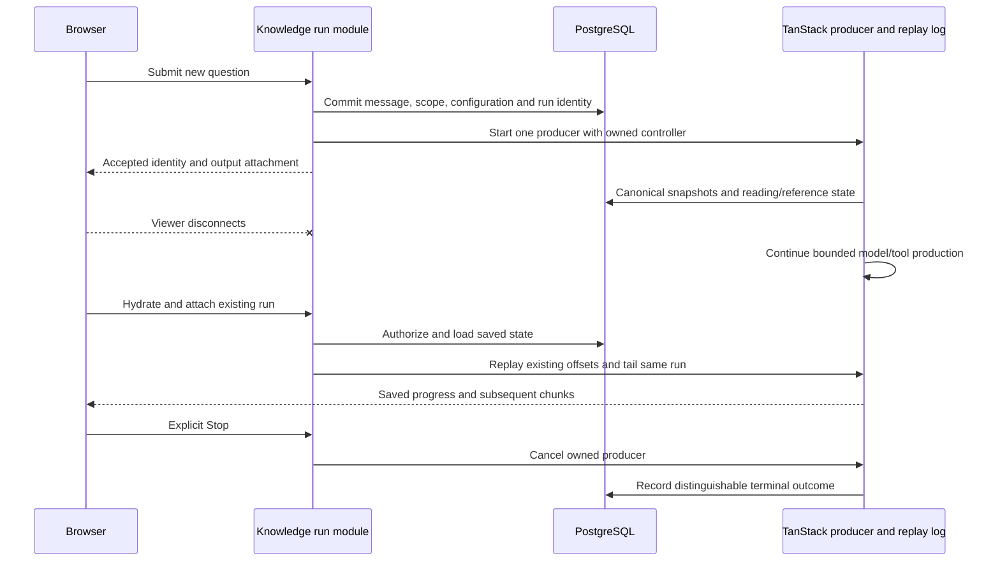

# Knowledge Runs, Evidence and Streaming Design

Status: target design, 2026-10-01. M04/M05 in [shared contracts](contracts.md)
own these interfaces. Browser reload recovery is part of the first delivery;
automatic model replay after application restart is not.

## Acceptance and authoritative history

The browser submits a question with stable submission identity and its intended
conversation/scope. The server authenticates, validates scope, coordinates the
conversation writer and commits the user message, run identity and captured QA
configuration before acknowledging acceptance or calling a model.

Treat browser history as presentation state. Construct model history from the
authorized canonical server transcript plus the accepted new question. Reject
forged actor/run identities and never feed an arbitrary client transcript into
a persistence middleware path that can replace canonical history.

Published persistence 0.7.1 server guidance describes incoming-ID merging and
cutoff behavior, while saveThread itself replaces its supplied canonical list.
The package entry guidance contains older overwrite wording. Verify the installed
source/conformance behavior instead of assuming append semantics. A small
adapter implements the contract; application acceptance and one-writer checks
protect the product guarantee separately.

withPersistence onStart/streaming snapshots can be best effort. They are not
the durable-acceptance transaction. Enable bounded snapshotStreaming checkpoints
and persist application-owned reading/reference state. Terminal success requires
the canonical final result to be stored; a persistence failure is not a passing
completed-history outcome. After restart, restore committed checkpoints rather
than claiming every emitted token survived a crash.

## Scope and version binding

| Request                                     | Resolved scope                                       |
| ------------------------------------------- | ---------------------------------------------------- |
| No document selection                       | Current authorized library discovery                 |
| Nonempty document selection                 | Validated server-enforced document allowlist         |
| Explicit empty list                         | Invalid scope; not library discovery                 |
| Stale/retired/unavailable selected document | Explicit unavailable/scope error; no silent widening |

Persist the conversation's mode/selection for follow-ups. Pin explicit selected
source versions at run acceptance. In library mode, pin a candidate on its first
substantive document read; later reads use that binding. Candidate discovery
alone does not permanently narrow future questions. New runs resolve current
versions and current eligibility again.

The four reading primitives check trusted visibility, run scope, binding and
finite output/read bounds. Distinguish historical inspection from new QA. Page
caches carry immutable identity and undergo the same checks before reuse.
Retirement can make a later QA read unavailable; it does not erase a previously
completed answer or its authorized historical reference.

## Reading and factual support

For each bound document, use the physical-page count independently:

- At most 20 pages: direct original-page reading is permitted within output and
  context limits; the entire short document need not fit in one call.
- More than 20 pages: inspect the tree, then request relevant original pages.
- Insufficient support: request additional relevant pages/sections through the
  maintained TanStack tool loop until support or a configured bound is reached.

The prompt carries this shared policy and evidence instructions. Services enforce
scope and budgets; a standalone MCP page-read does not need a prior tree read.
Paginated names/descriptions/metadata support library discovery. Clearly matching
candidates can proceed; ambiguous intended targets yield a clarification outcome.
Cross-document questions preserve source qualifiers and unresolved conflicts.

History helps identify the subject/time period meant by a follow-up. Earlier
assistant prose is not new factual evidence. Reading stored pages again can
reuse a compatible cache without parsing the PDF, but adds a current-run read
record after authorization/scope/version checks.

Report evidence gaps separately from incomplete discovery/reading or exhausted
budgets. Even complete metadata enumeration is not exhaustive original-content
reading, and a bounded failure to find a fact does not prove its absence.

## Citation issuance and inspection

Before returning a citation handle to the Agent, persist the corresponding
page-read identity in the run. A handle binds run, owner, document, source version
and one physical page. Validate it against that registry, current access, run
scope, relationship/bounds and source availability before making it navigable.

Place document-name/physical-page citations next to supported claims. Use
separate handles for multi-page support. The original viewer/resource resolves
the bound immutable version, not the latest source or a filename. Printed labels
can be shown separately; paragraph/block precision and highlighting are excluded.

Deterministic validation certifies location and authorization. It does not
certify that a page supports a claim semantically; measure that separately
against original evidence. Invalid handles are explicit validation failures,
not rewritten into plausible-looking citations by a transport adapter.

## One producer, multiple observers

Use core 0.63.0's memoryStream durability with toServerSentEventsResponse for the
initial stream and resumeServerSentEventsResponse for replay. Its fresh producer
can continue draining after the response reader cancels. Give chat and delivery
the server-owned cancellation controller; do not combine browser Request.signal
into the producer signal. Attachment readers have their own disconnect lifetime.

M06 serves SDK Responses through raw Start server routes and uses AI React's
supported connection surface for presentation. Start's request context carries
the browser signal, so framework/request teardown cannot own the accepted-run
controller. Query caches metadata and supplies authorized hydration snapshots;
it does not maintain another writable transcript alongside AI React. UI teardown
detaches without issuing the product Stop command. See
[Web/runtime integration](frontend-and-runtime.md) for transport/cache ownership.

Start the SDK producer at accepted-run dispatch, even if no subscriber remains;
do not wait for a later GET to invoke the model. Retain only application run
control/identity and the supported log, not a second Agent loop or a custom SSE
protocol. P01's controlled probe verifies the exact installed-version plumbing;
P11 establishes the composed application behavior.

Authorize before hydration/replay. Reconcile stable message/part IDs to avoid
duplicated output, and retain the run's original budgets. Cover attachment before
the first chunk and configure finite first-output waiting for measured model
latency. A tool-loop iteration's RUN_FINISHED is not necessarily the final
producer completion; use the SDK's true delivery close/lifecycle behavior.

When a finished log expires, serve the persisted result. Missing delivery state
never invokes a fresh model. An active run in the current process has one
registered producer/log; an inconsistent missing producer is an explicit
interruption/failure outcome rather than a replay attempt.

## Stop and restart

Stop is an authenticated server command that records cancellation intent and
signals the run's controller with the installed SDK's explicit cancellation
mechanism/reason so the delivery layer cannot classify Stop as a detach.
Propagate it to model/tool work and retain saved history. A local reader abort
is not Stop. Do not accept another writer or allow
conversation deletion merely because the last viewer left.

Expose completed, failed, stopped and interrupted outcomes distinctly. Translate
supported SDK statuses into product outcome/reason fields instead of inventing
SDK enums. Cancellation verification covers actual local/provider/tool signals;
remote termination/billing remains provider-dependent and is reported separately.

After application restart, mark unfinished runs from the prior execution
interrupted. Serve committed history, source bindings and outcomes. Startup,
navigation and hydration do not resume model calls. A manual resend is a new
turn/run with current scope/configuration and the previous record retained.

Creating a turn and deleting a conversation coordinate authoritative active-run
state. Deletion while queued/running/stopping is rejected. Explicit Stop followed
by a terminal outcome permits deletion; document originals and other conversations
are unaffected. Rename/history/reload retain conversation identity.

## Independent MCP QA

Each question_answer call creates its own bounded Knowledge run with the captured
QA role and verified token scope. It uses the same four tools, reading policy,
evidence records and citations. It does not require/create a user-visible Web
conversation or borrow the caller Agent's model/history.

The MCP adapter translates the final answer/clarification/gap/incomplete outcome
to the maintained protocol. It does not expose question_answer as a reading tool
inside the same loop. Low-level reads and immutable resources work independently
without triggering a model call. Web's disconnect-continuation guarantee is not
silently extended into a new MCP job-subscription product.

## Verification matrix

Use a real database and controlled provider through public HTTP and an official
MCP client. Cover 20/21-page and mixed-length scopes, ambiguous discovery, wrong
document temptations, unsupported history assertions, cache reuse and invalid
references. Record exact source identities and provider/tool call counts.

Browser checks cover reload/closure/navigation with zero viewers, early and late
reattachment, completed-log fallback, Stop, mobile return position and stable
history. Process-restart tests prove interrupted state and no execution replay.
Concurrent submission/deletion tests prove the writer guard.

Run the persistence conformance kit for the implemented stores and explicitly
declare omitted optional capabilities. Do not add media-generation/approval
stores to pass unrelated tests. Real-provider compatibility, actual cancellation
and semantic QA/citation quality require separately disclosed measurements.
