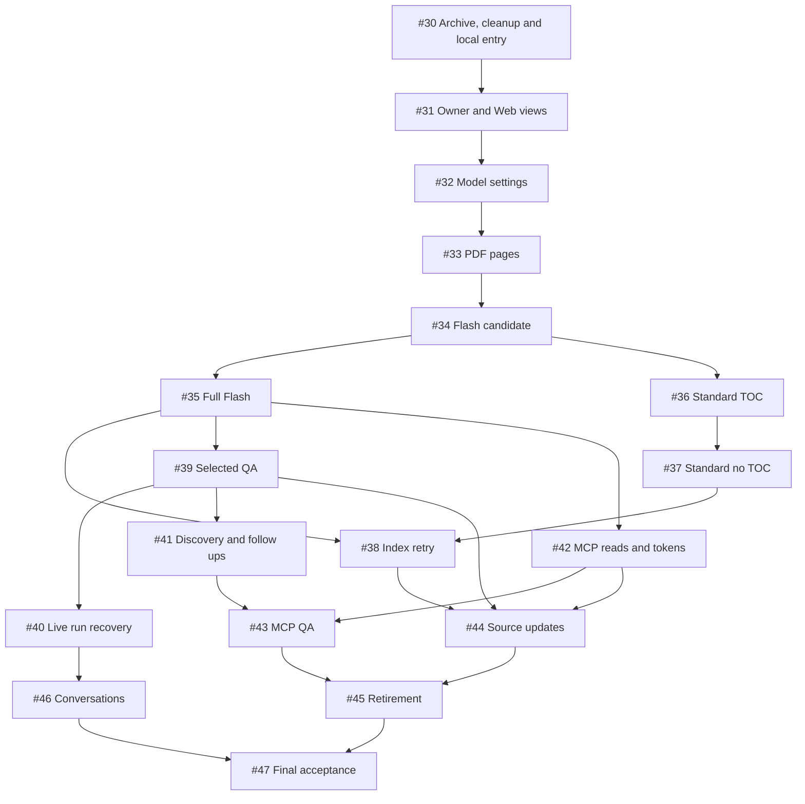

# PageIndex v1 Work Item Map

Status: published, 2026-10-01. The user requested a construction blueprint and
breakdown for [Spec #29](https://github.com/L-1ngg/loreweave/issues/29), then selected
verified archival and legacy cleanup before new feature construction. The 18
work items below are published with native sub-issue and blocking relationships.
The initial publication left the parent specification unchanged. A subsequent
user instruction to prefer the TanStack ecosystem/Intent refines engineering
selection in Spec #29, the design and affected live items; product AC01-AC35,
slice identities and the dependency graph remain unchanged.

Read [the blueprint](../../../pageindex-v1-blueprint.md), [module map](../README.md)
and [contracts](../contracts.md), plus [Web/runtime integration](../frontend-and-runtime.md),
before executing the live work items.
Local ticket bodies are publication snapshots. [plan.json](plan.json) records
the fixed slice-to-issue map. Live GitHub issues own current status, blockers and
execution evidence; the snapshots do not form a second implementation tracker.

## Published slices

Every product slice includes its schema/state, module behavior, transport/UI and
observable checks. P01 archives and verifies the old work/data, removes the
legacy executable tree and establishes the clean local construction baseline
before dependent feature work. P04-P08 turn the parser/index risk into inspectable
import/tree paths. P18 is integration/evaluation and verifies that retired paths
have not returned; it does not defer cleanup or replace each slice's own checks.

Slice IDs remain stable construction identifiers. Each row links its local
snapshot and the live GitHub work item; blocker links use actual issue numbers.
The live issues contain the build outcome, acceptance checklist, parent coverage
and evidence requirements without prescribed source paths.

| Slice snapshot                                     | Live work item                                       | Title                                                           | Blocked by                                                                                                                                                       |
| -------------------------------------------------- | ---------------------------------------------------- | --------------------------------------------------------------- | ---------------------------------------------------------------------------------------------------------------------------------------------------------------- |
| [P01](01-recoverable-local-baseline.md)            | [#30](https://github.com/L-1ngg/loreweave/issues/30) | Archive legacy code and prepare a clean construction baseline   | None                                                                                                                                                             |
| [P02](02-owner-login-working-views.md)             | [#31](https://github.com/L-1ngg/loreweave/issues/31) | Open the local single-owner Web workspace                       | [#30](https://github.com/L-1ngg/loreweave/issues/30)                                                                                                             |
| [P03](03-model-connections-role-defaults.md)       | [#32](https://github.com/L-1ngg/loreweave/issues/32) | Configure model connections and index/QA defaults               | [#31](https://github.com/L-1ngg/loreweave/issues/31)                                                                                                             |
| [P04](04-pdf-import-page-inspection.md)            | [#33](https://github.com/L-1ngg/loreweave/issues/33) | Import PDFs and inspect stored original pages                   | [#32](https://github.com/L-1ngg/loreweave/issues/32)                                                                                                             |
| [P05](05-flash-initial-tree.md)                    | [#34](https://github.com/L-1ngg/loreweave/issues/34) | Inspect Flash layout-derived chapter trees                      | [#33](https://github.com/L-1ngg/loreweave/issues/33)                                                                                                             |
| [P06](06-flash-full-optimization-summaries.md)     | [#35](https://github.com/L-1ngg/loreweave/issues/35) | Publish fully optimized Flash indexes                           | [#34](https://github.com/L-1ngg/loreweave/issues/34)                                                                                                             |
| [P07](07-standard-printed-toc.md)                  | [#36](https://github.com/L-1ngg/loreweave/issues/36) | Index printed tables of contents with Standard                  | [#34](https://github.com/L-1ngg/loreweave/issues/34)                                                                                                             |
| [P08](08-standard-no-toc-subdivision.md)           | [#37](https://github.com/L-1ngg/loreweave/issues/37) | Complete Standard without a printed TOC                         | [#36](https://github.com/L-1ngg/loreweave/issues/36)                                                                                                             |
| [P09](09-index-restart-manual-retry.md)            | [#38](https://github.com/L-1ngg/loreweave/issues/38) | Recover interrupted indexing with explicit retry                | [#35](https://github.com/L-1ngg/loreweave/issues/35), [#37](https://github.com/L-1ngg/loreweave/issues/37)                                                       |
| [P10](10-selected-document-qa-citations.md)        | [#39](https://github.com/L-1ngg/loreweave/issues/39) | Answer selected-document questions with page citations          | [#35](https://github.com/L-1ngg/loreweave/issues/35)                                                                                                             |
| [P11](11-qa-reattachment-stop-interruption.md)     | [#40](https://github.com/L-1ngg/loreweave/issues/40) | Keep accepted answers running across browser disconnects        | [#39](https://github.com/L-1ngg/loreweave/issues/39)                                                                                                             |
| [P12](12-library-multi-document-followups.md)      | [#41](https://github.com/L-1ngg/loreweave/issues/41) | Discover documents and ground scoped follow-up questions        | [#39](https://github.com/L-1ngg/loreweave/issues/39)                                                                                                             |
| [P13](13-mcp-tokens-reading-resources.md)          | [#42](https://github.com/L-1ngg/loreweave/issues/42) | Authorize MCP clients to read documents and page resources      | [#35](https://github.com/L-1ngg/loreweave/issues/35)                                                                                                             |
| [P14](14-mcp-independent-question-answer.md)       | [#43](https://github.com/L-1ngg/loreweave/issues/43) | Answer independent MCP questions through shared QA              | [#41](https://github.com/L-1ngg/loreweave/issues/41), [#42](https://github.com/L-1ngg/loreweave/issues/42)                                                       |
| [P15](15-explicit-source-updates.md)               | [#44](https://github.com/L-1ngg/loreweave/issues/44) | Update a document without changing historical citations         | [#38](https://github.com/L-1ngg/loreweave/issues/38), [#39](https://github.com/L-1ngg/loreweave/issues/39), [#42](https://github.com/L-1ngg/loreweave/issues/42) |
| [P16](16-document-retirement-history.md)           | [#45](https://github.com/L-1ngg/loreweave/issues/45) | Retire documents while retaining authorized historical evidence | [#43](https://github.com/L-1ngg/loreweave/issues/43), [#44](https://github.com/L-1ngg/loreweave/issues/44)                                                       |
| [P17](17-basic-conversation-management.md)         | [#46](https://github.com/L-1ngg/loreweave/issues/46) | Manage conversations and deliberately resend failed questions   | [#40](https://github.com/L-1ngg/loreweave/issues/40)                                                                                                             |
| [P18](18-integrate-evaluate-retire-old-runtime.md) | [#47](https://github.com/L-1ngg/loreweave/issues/47) | Verify and evaluate the complete replacement                    | [#45](https://github.com/L-1ngg/loreweave/issues/45), [#46](https://github.com/L-1ngg/loreweave/issues/46)                                                       |

## Dependency graph

P01 is the initial frontier; verified archival, removal and baseline checks gate
all product construction. After P05, full Flash and Standard are independent.
After full Flash, Web QA and MCP primitive reading can proceed while Standard
completion/retry continues. Reattachment, broader QA and basic conversations
are separate slices; source retirement joins Web/MCP QA with update semantics.
P18 is blocked by the completed functional frontier, not by every ancestor again.

Each edge has a concrete completion reason:

| Edge group         | Gate                                                                                                                     |
| ------------------ | ------------------------------------------------------------------------------------------------------------------------ |
| P01 -> P02 -> P03  | Verified archive and legacy removal, clean local entry, then authenticated owner-managed configuration                   |
| P03 -> P04         | Upload attempts capture real configured index role; parser engine viability is already probed in P01                     |
| P04 -> P05         | Shared original/page artifacts and accepted import identity                                                              |
| P05 -> P06/P07     | Validated candidate/tree and guarded attempt/publication interfaces; Standard does not depend on Flash inference success |
| P07 -> P08         | Standard TOC schema/model/publication path reused for no-TOC and subdivision                                             |
| P06/P08 -> P09     | Complete mode-specific artifacts are needed to verify retry and compatibility/mode switching                             |
| P06 -> P10/P13     | One ready index enables original-backed QA or independent MCP reads; neither needs Standard completion                   |
| P10 -> P11/P12     | Accepted QA/history/evidence foundation for recovery and broader scope/follow-ups                                        |
| P12/P13 -> P14     | Shared library/multi-document QA plus authenticated MCP transport                                                        |
| P09/P10/P13 -> P15 | Both-mode preparation/retry and actual Web/MCP historical references                                                     |
| P14/P15 -> P16     | Full new-query surfaces plus source-version/update publication guards                                                    |
| P11 -> P17         | Real Stop/terminal/history behavior is required before active-conversation deletion                                      |
| P16/P17 -> P18     | Complete functional frontier with all ancestors before integrated acceptance/evaluation                                  |

## Acceptance allocation

This matrix allocates AC01-AC35 across the contributing slices. A row shared by
several tickets requires their combined implementation/evidence, not a claim
that an intermediate ticket satisfies the whole parent outcome. P18 verifies
all rows end to end; P01 owns upfront retirement and its recovery evidence, while
P18 owns measured evaluation and reproducible final local delivery, including a
check that retired execution paths remain absent.

| Parent outcome | Contributing drafts               |
| -------------- | --------------------------------- |
| AC01           | P01, P18                          |
| AC02           | P04, P09                          |
| AC03           | P04, P05, P07, P08                |
| AC04           | P05, P06, P07, P08                |
| AC05           | P04, P12                          |
| AC06           | P15                               |
| AC07           | P10, P12                          |
| AC08           | P12, P14                          |
| AC09           | P10, P12, P14, P15                |
| AC10           | P04, P10                          |
| AC11           | P11, P17                          |
| AC12           | P11, P17                          |
| AC13           | P13, P14                          |
| AC14           | P02, P13, P14, P16                |
| AC15           | P09                               |
| AC16           | P06, P08, P09, P10, P11, P12, P14 |
| AC17           | P18                               |
| AC18           | P01, P18                          |
| AC19           | P05, P06, P07, P08, P09           |
| AC20           | P05, P06, P07, P08                |
| AC21           | P04, P09                          |
| AC22           | P12, P14, P16                     |
| AC23           | P10, P12, P14                     |
| AC24           | P10, P15                          |
| AC25           | P13, P14                          |
| AC26           | P12, P16                          |
| AC27           | P11, P17                          |
| AC28           | P03, P06, P07, P08, P09, P10, P14 |
| AC29           | P03, P07, P08, P10, P14           |
| AC30           | P04, P15                          |
| AC31           | P16                               |
| AC32           | P02                               |
| AC33           | P02, P13                          |
| AC34           | P02, P11, P13                     |
| AC35           | P17                               |

## Publication record

- Published 18 work items, #30 through #47, with work-item and ready-for-agent labels.
- All 18 are native sub-issues of Spec #29; all 23 blocking edges match their issue bodies.
- Re-read every issue body/title/state/label and its native blocking links after publication.
- Verified Spec #29's body/title/state/labels/comments remained unchanged.
- Retained full AC01-AC35 coverage, an acyclic graph without redundant edges and P18's complete ancestor frontier.

## Execution

The initial frontier is [#30](https://github.com/L-1ngg/loreweave/issues/30). It must finish external archival,
restore verification, active legacy removal and clean baseline checks before
any dependent product work starts.

Read the selected live issue and its current blockers' completion evidence.
Execute only the frontier whose blockers have completed; a readiness label or
publication alone does not authorize runtime work, paid model calls, destructive
data migration, deployment or parent-issue completion. The active user request
determines implementation/delivery authorization.

No runtime cleanup, parser prototype, paid-provider evaluation or browser
acceptance has been performed by creating this design and publishing work items.
