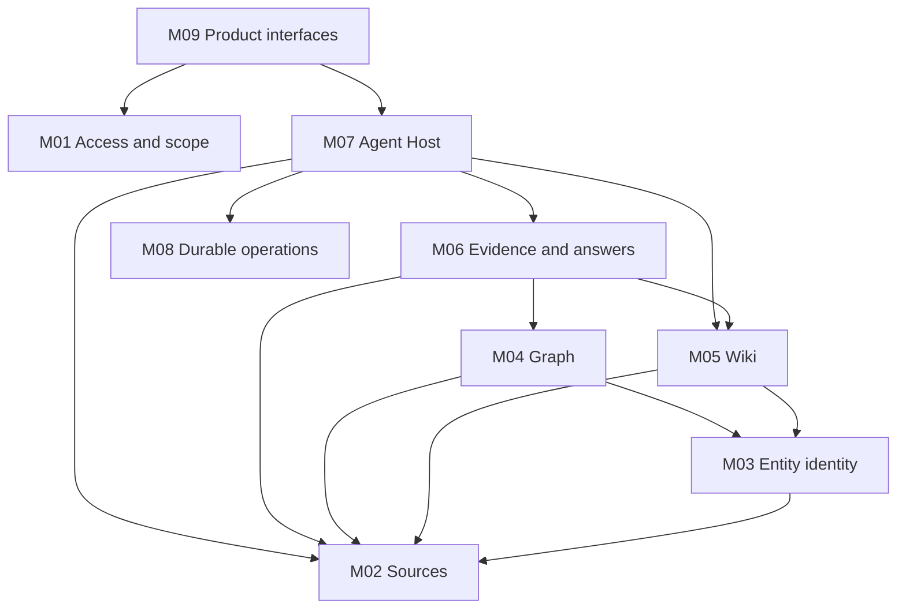

# RAG v1 construction modules

Status: first aligned construction baseline, 2026-09-10. Module boundaries and
work-item granularity are selected under the user's design delegation. Product
implementation has not started.

Read [the specification](../../../.scratch/rag-v1/spec.md) for product scope,
[shared contracts](contracts.md) for cross-module rules, and the relevant module
below for its interface. [Work items](../../../.scratch/rag-v1/README.md) describe
vertical delivery slices. A module is a responsibility and test seam, not a
separately deployed service or necessarily a workspace package.

| ID | Module | Small public surface | Owns |
| --- | --- | --- | --- |
| M01 | [Access and scope](modules/01-access.md) | Authenticate, resolve scope, authorize operation | Members, credentials, trusted actor and scope |
| M02 | [Sources](modules/02-sources.md) | Submit source/change, resolve passage, inspect version | Documents, immutable versions, passages and activation |
| M03 | [Entity identity](modules/03-identity.md) | Resolve mentions, inspect identity, correct resolution | Mentions, canonical identity, evidence and identity revision |
| M04 | [Graph](modules/04-graph.md) | Refresh claims, retrieve neighborhood | Qualified source claims and bounded traversal |
| M05 | [Wiki](modules/05-wiki.md) | Maintain topics, read page, restore edit | Pages, edit sets, checks, publication and navigation |
| M06 | [Evidence and answers](modules/06-evidence.md) | Retrieve evidence, finalize answer | Route fusion, evidence registry, citation/freshness checks |
| M07 | [Agent Host](modules/07-agent-host.md) | Start turn, cancel run, observe run | Forge integration, conversation persistence and run policy |
| M08 | [Durable operations](modules/08-operations.md) | Submit operation, inspect outcome, execute leased work | Jobs, attempts, deduplication, outcome and worker fencing |
| M09 | [Product interfaces](modules/09-interfaces.md) | Browser, HTTP and MCP interaction | Transport validation, UI and event delivery |

The diagram shows synchronous business reads/calls. Background handlers are
registered by the composition root with M08; M08 does not import Wiki/Graph to
discover them. M01 policies apply at operation entry points even where omitted
from the diagram. M08 operation metadata and domain changes share transactions
through an internal unit-of-work adapter; unrelated modules do not write each
other's tables. PostgreSQL and model adapters are infrastructure, not extra
business modules with pass-through interfaces.

Entity identity is separate so Wiki need not wait for graph extraction. M06
can answer from sources while either derived representation is unavailable.
M07 chooses actions; it delegates evidence decisions to M06 and durable effects
to domain operations. Frontend and MCP consumers share those same interfaces.

Architectural rationale: [shared provenance](../../adr/0001-shared-wiki-graph-provenance.md),
[built-in conversation](../../adr/0002-built-in-knowledge-conversation.md), and
[Forge SDK/Bun host](../../adr/0003-forge-agent-sdk-and-bun-host.md). The
[Forge reuse investigation](../../research/forge-agent-reuse.md) records the
source baseline and adapter verification limits.

## Document ownership

| Document | Authority |
| --- | --- |
| Construction spec | Product requirements and numbered acceptance outcomes |
| Shared/module contracts | Interface meaning, state ownership and invariants |
| ADRs | Hard-to-reverse choices and their rationale |
| Evaluation plan | Dataset and quality/performance measurement defaults |
| Design discussion | User confirmations and delegations, including historical choices |
| Blueprint | Architectural overview and navigation to the construction documents |
| Local work items | Delivery slices, blockers, acceptance criteria and execution evidence |

The spec consolidates the earlier discussion; it does not erase confirmed goals.
[Alignment notes](alignment.md) record what this pass clarified and which claims
still require executable evidence. Start refinement with a concrete boundary
scenario from that file rather than restarting the full interview.
