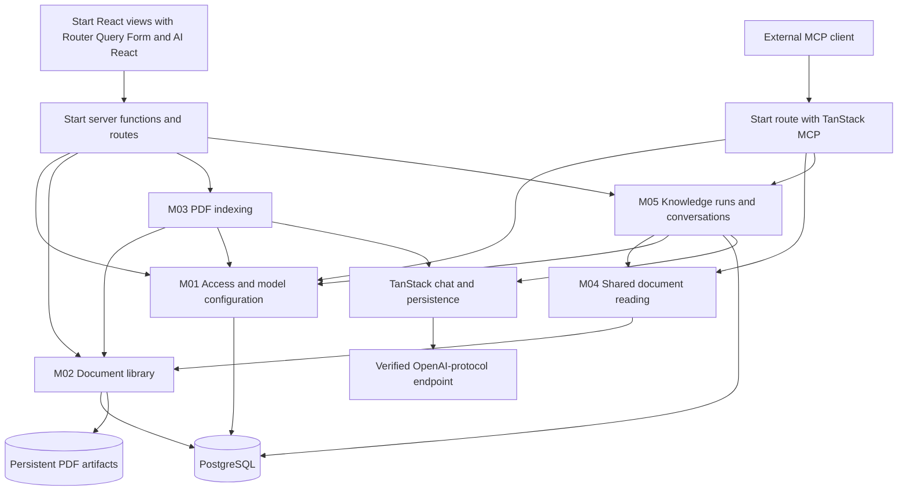

# LoreWeave PageIndex v1 Construction Blueprint

Status: construction blueprint with implemented #30-#46, 2026-10-01.
#47 records final integration and measured acceptance.
Product scope is owned by [Spec #29](https://github.com/L-1ngg/loreweave/issues/29),
read in full with its comments at revision 2026-10-01T03:39:38Z. The
TanStack ecosystem selection is recorded in the specification and design below.
This blueprint selects engineering details under the user's design delegation;
it does not add product requirements or report passing implementation evidence.

## Construction entry points

- [Module map](design/pageindex-v1/README.md): responsibility, interface and ownership.
- [Shared contracts](design/pageindex-v1/contracts.md): identities, state and transactions.
- [Indexing design](design/pageindex-v1/indexing.md): PDF extraction, Flash, Standard and retry.
- [QA and streaming design](design/pageindex-v1/qa-and-streams.md): reading, evidence and run lifetime.
- [Web/runtime integration](design/pageindex-v1/frontend-and-runtime.md): TanStack responsibilities, transports, caches, Intent and Bun gates.
- [Ticket plan](design/pageindex-v1/tickets/README.md): vertical slices, dependencies and AC coverage.
- [Domain language](../CONTEXT.md) and [ADR-0005](adr/0005-pageindex-typescript-replacement.md).

The previous [RAG blueprint](rag-v1-blueprint.md), module contracts and Issues
#1-#28 are historical. P01 archived and verified a recoverable baseline, then
removed the legacy executable tree before feature construction; see the
[retirement record](history/pageindex-retirement.md). Use a
fresh schema and clean entry points; old internal interfaces and data are not
migration constraints.

## Target and completion boundary

Deliver one local, single-owner application with Web conversations and read-only
MCP. Use TypeScript, TanStack Start, React 19+, Router, Query, Form and TanStack
AI; retain Bun, Vite, PostgreSQL and Drizzle. Use Intent for package-owned
development guidance. Original PDF files reside in a persistent local artifact
directory; PostgreSQL owns their immutable
identities and all relational state. Browser requests use the application;
model credentials and model calls stay on the server.

The complete delivery includes both Flash and Standard, with Flash preselected,
navigation summaries enabled and full Flash optimization. It includes library
discovery, optional selected-document scope, grounded answers, page citations,
live-run recovery, explicit Stop, source updates/retirement, model settings and
named MCP tokens. Intermediate tickets demonstrate narrower paths; none is an
alternative definition of the finished first version.

Self-hosted application deployment packaging is deferred. Local database
provisioning may use a development container. The delivered runtime has no
Python sidecar, PageIndex Cloud dependency, vector retrieval, Wiki/graph,
Forge/Pi loop, organizational accounts, OCR or additional input formats.

## Architecture

M06 owns the Web/HTTP/MCP adapters. The diagram separates entry points to show
request flow; it does not prescribe separate deployments or packages. Compose
the six modules in one application process, with one database client and a
bounded indexing worker. The Knowledge Agent executes shared reading tools
in-process. It does not call its own MCP endpoint.

## Maintained libraries and application-owned work

| Concern                              | Selection                                               | Application responsibility                                                           |
| ------------------------------------ | ------------------------------------------------------- | ------------------------------------------------------------------------------------ |
| Full-stack Web and HTTP entry        | TanStack Start with React 19+ and Vite                  | Compose domain modules, trusted context and Bun lifecycle                            |
| Navigation and server-data cache     | TanStack Router and Query                               | Authorized deep links, cache identities/invalidation and source-return position      |
| Form state and validation            | TanStack Form                                           | Shared input schemas, server validation and transient secret handling                |
| PDF bytes and page geometry          | PDF.js / pdfjs-dist candidate                           | Validate Bun compatibility, reading order, heading inference and coverage            |
| Model tool loop and typed output     | TanStack AI with its OpenAI adapter                     | Prompts, document scope, evidence records, budgets and schema validation             |
| React chat state and stream protocol | TanStack AI React integration                           | View layout, server-authoritative history and source inspection                      |
| Live output replay                   | TanStack core memoryStream and SSE response helpers     | Authorize attachment, own run controller and prevent execution replay                |
| Conversation persistence             | TanStack persistence contracts/middleware               | Small Drizzle/PostgreSQL adapter, acceptance transaction and source state            |
| External MCP                         | TanStack createMCPServer                                | Owner-issued token verification and shared tool/resource implementations             |
| Authentication and secret handling   | Maintained session facilities and standard cryptography | Sole-owner capability policy, hashed token verification and sealed model credentials |
| Agent development guidance           | TanStack Intent with package-owned skills               | Discover version-matched guidance and preserve project rules in generated mappings   |

The researched candidate versions are core 0.63.0, React 0.29.3, MCP 0.6.0 and
persistence 0.7.1. Preparation rechecks compatible provider/client packages and
locks a tested set. Candidate versions are not a claim that these packages are
installed or integrated. Read the selected packages' own skills and source;
their shipped skill metadata can lag their actual API.

Start replaces the default independent Hono entry. Its server functions handle
ordinary internal commands/queries; raw routes preserve multipart, PDF Range/HEAD,
SDK SSE and MCP Request/Response semantics. Query owns metadata caches; AI React
owns message presentation while M05/PostgreSQL own canonical history. DB, Table,
Virtual and other TanStack libraries are available when a concrete requirement
justifies them. The [Web/runtime design](design/pageindex-v1/frontend-and-runtime.md)
records adoption criteria, Intent workflow and the P01 compatibility probes.

TanStack persistence ships contracts and a Drizzle recipe, not a ready
PostgreSQL backend. Implement the required stores against the application's
database. Add optional stores only for actual use; media-generation storage,
approvals, distributed locks and a general job framework are not needed here.

## Persistence and identities

| Records                                                             | Owner | Identity and lifetime                                                           |
| ------------------------------------------------------------------- | ----- | ------------------------------------------------------------------------------- |
| Owner/session and MCP token verification                            | M01   | Sole owner; independent revocable client tokens, no stored token plaintext      |
| Model connections, immutable connection revisions and default roles | M01   | Server-held credentials; changed defaults affect new work                       |
| Documents and immutable source versions                             | M02   | Document identity independent of filename; original bytes never overwritten     |
| Page artifacts, index revisions and tree nodes                      | M02   | Physical pages bound to source version; node identity bound to index revision   |
| Indexing operations, attempts and validated stage manifests         | M03   | Accepted operation stable across retry; each attempt has captured configuration |
| Conversations, canonical messages and Knowledge runs                | M05   | Stable conversation/message/run identities, one active conversation writer      |
| Run document bindings, page reads and Source references             | M05   | Evidence belongs to its run and immutable version/page                          |

Use a dedicated new database/schema and the existing reviewed migration flow.
Do not apply retired migrations to the new database, automatically convert old
knowledge data, or run a second hidden DDL owner. Old data remains recoverable.

Large PDF bytes and optional layout payloads use opaque server-assigned artifact
keys. Preserve the original before acknowledging an import, then commit its
operation/version metadata. A failed commit is not acceptance. A staged file
without committed metadata is not a discoverable document. References expose
document/version/page identity, never an artifact path.

Connection revisions retain the configuration and server-held credential used
by accepted work. A run references that revision plus its Model ID and finite
budget snapshot. Public provenance omits secrets. Editing a connection, its key
or defaults cannot silently route an existing queued/active task elsewhere.

## Three complete product paths

### Import and index

1. Authenticate the owner and accept an ordinary upload or explicit Update file.
2. Persist immutable bytes, operation identity, selected mode and captured index
   configuration before acknowledging the accepted work.
3. Extract page text/geometry/labels/outlines with the shared PDF engine.
4. Execute the selected Flash or Standard route. Optimize/subdivide as required
   and generate navigation summaries from finalized original-backed ranges.
5. Validate source/page/tree artifacts and atomically activate the prepared
   version/index if the expected document revision and retirement state permit.
6. Expose durable progress and explicit outcomes; a process restart leaves
   unfinished attempts interrupted until manual retry.

See [indexing design](design/pageindex-v1/indexing.md). An upload is not ready
merely because its bytes or extracted pages exist. Preparation failure keeps an
existing effective source readable. A same-operation retry retains its identity;
a deliberate second upload, even with the same name, is a separate document.

### Ask, inspect and reconnect

1. Authenticate, validate the conversation and resolve library/selected scope.
2. Commit the new question, run identity, scope and captured QA configuration.
3. Start one server-owned TanStack producer with authoritative server history.
4. Use shared reading tools: short documents may be read directly; longer ones
   use the tree first. Read additional relevant pages within finite bounds.
5. Record actual page reads and issue version-bound citation handles. Validate
   handles before presenting citations; semantic support is measured separately.
6. Persist partial checkpoints, reading state and terminal output. Readers
   attach to this run's output log without starting another producer.

Browser refresh/closure changes observation. Explicit Stop requests producer
cancellation. Application restart records interruption and restores committed
history, without automatically replaying model calls. See
[QA and streaming design](design/pageindex-v1/qa-and-streams.md).

### Use MCP independently

The four primitives are browse_documents, get_document,
get_document_structure and get_page_content. They return authorized metadata,
structure and original content without invoking the server's QA model.
question_answer calls the shared bounded QA module with the configured QA role,
creating an independent run without a Web conversation.

The HTTP adapter verifies the current named token before passing trusted context
to the TanStack MCP server. Tools/resources recheck current access and document
eligibility where applicable. The internal Agent does not receive question_answer
as a tool. No MCP upload, source update, deletion or settings administration is
published. Streamable HTTP and immutable page resources are acceptance surfaces.

## Web working views

| View             | Workflow                                                                                                               |
| ---------------- | ---------------------------------------------------------------------------------------------------------------------- |
| Conversation     | Default authenticated entry, history, scope, streamed answers, reads/citations, Stop and basic conversation management |
| Document library | Upload/mode, progress, retry, Update file, retirement, metadata and tree/page inspection                               |
| Settings         | Model connections, two default roles and named MCP tokens                                                              |

Desktop citations open the bound original beside the conversation. Mobile opens
a separate original view and returns to the same message and reading position.
Deep links restore authorized state. Navigation cannot cancel accepted work or
submit a question again. Route naming and viewer internals are engineering
choices; the [contracts](design/pageindex-v1/contracts.md) give a coherent target
HTTP surface without preserving the previous URLs.

## Preparation gates and delivery order

P01 completes legacy retirement before P02 or any replacement product work.
Leaving inactive legacy code until final acceptance would pollute repository
search, typechecking, tests, dependencies and default entry points. The user's
construction-order decision is to clear those paths first.

First inventory tracked and untracked work, the current revision and existing
database/original artifacts. Preserve an exact recoverable archive outside the
active repository and demonstrate restoration in a separate location before
removing anything. Git history alone does not preserve uncommitted work. Keep
credentials and private data in private storage; the repository retains only
non-secret provenance and recovery instructions. A recovery archive is not a
second maintained runtime or a searchable legacy source directory.

Then remove the retired implementation and prepare the minimal new local entry:

| Area                                                                                  | P01 disposition                                                                                                      |
| ------------------------------------------------------------------------------------- | -------------------------------------------------------------------------------------------------------------------- |
| Forge/Pi, Wiki/graph/entity, embedding/vector/RRF execution                           | Remove active source, vendored runtime and exclusive dependencies after verified archival                            |
| Legacy Web/API/MCP adapters and their dedicated tests/fixtures                        | Remove or replace their active entry points with the new construction baseline                                       |
| Legacy schema, migrations and worker/development/evaluation scripts                   | Remove from active execution; preserve old data independently and start a fresh schema                               |
| Root package scripts, configuration, build/typecheck/test and CI targets              | Retain suitable tooling, rewrite targets for the new baseline and eliminate legacy loading or checks                 |
| Old runtime instructions and source-linked design documents                           | Move or mark as historical, resolve source links through the archived baseline and point active guidance at Spec #29 |
| Current blueprint/contracts, attributable history/notices and unrelated user material | Preserve; selectively reuse foundations only after checking their dependencies                                       |

Cleanup inventories distinguish retirement candidates from unrelated user work.
Existing databases, original artifacts and private settings are preserved rather
than purged. New startup uses explicit construction configuration and does not
implicitly load the old environment or apply its migrations. Keep Bun,
React/Vite, PostgreSQL and Drizzle; establish the selected Start/Router/Query/Form
and AI baseline using version-matched Intent guidance. Lock and probe the Bun
adapter, SSR/hydration, raw upload/original/SSE and MCP boundaries. Install only
the dependencies needed by the new baseline.

P01's completion evidence includes successful restore, removal inventory,
legacy-free default search/execution/check targets and passing baseline checks.
P18 performs full integration/evaluation and checks that no retired dependency
or entry point has been reintroduced; it does not defer the original cleanup.

The early SDK probe uses a controlled provider to establish tool calls, typed
outputs, authoritative persistence and continued generation with zero viewers.
The PDF import/Flash/Standard tickets then establish extraction and tree quality
before general QA/MCP implementation expands. Model settings/login work is the
minimal usable context for these real import workflows.

The planned frontier is described in the [ticket plan](design/pageindex-v1/tickets/README.md).
Flash refinement and Standard construction can proceed independently after the
shared import/tree path. QA and MCP reading need one validated index, not both
mode implementations. Version/retry/final acceptance requires the complete pair.

No compatibility shim for Forge/Wiki is required. This is a full product
replacement, not a mechanical rename with thousands of active callers, so an
expand-contract migration of retired internals would add work without serving
the accepted scope. Recovery preserves history; new entry points preserve a
verifiable construction path.

## Verification and claims

Use public HTTP plus a real official MCP client against disposable real
PostgreSQL. Use controlled providers for deterministic routing, state, limits,
scope and reference checks. Run the TanStack persistence conformance testkit
for the implemented store surface. Use Playwright on desktop/mobile for layout,
navigation, citations, reload and Stop. Each slice supplies its own evidence;
final integration exercises interactions across all slices.

Freeze representative PDFs, expected physical-page evidence and licensing/
provenance. Compare corresponding Flash/Standard artifacts with the fixed
PageIndex Python reference outside the delivered runtime. Include rejected
imports in the denominator. Score extraction/order/tree coverage, factual QA and
semantic citation support separately; exact tree IDs or LLM wording are not gates.

Select finite call/page/context/output/concurrency/time defaults from the early
measurements and disclose them. Existing 30/60-second deadlines and eight-slot
policies are historical, not inherited limits. Do not invent numerical quality,
capacity or cost guarantees before measurement. Real-provider use requires an
authorized connection/workload; this planning task performs no paid calls.

Final acceptance requires AC01-AC35 coverage with actual checks, a reproducible
local setup and a disclosed measured evaluation. A fixture pass, package-source
inspection or upstream benchmark cannot stand in for TS model quality. Record
Ran / Not run / Why / Risk and unresolved defects; incomplete required evidence
keeps the final work item incomplete.

## Source evidence

- [PageIndex indexing reference](https://github.com/VectifyAI/PageIndex/tree/d2693d80791a86345ef78b3234834f5fe53a70a0)
  and [reading/citation reference](https://github.com/VectifyAI/PageIndex/tree/f279431eb4e47884862961b9718df180552f417a).
- [TanStack core 0.63.0 SSE/durability implementation](https://unpkg.com/@tanstack/ai@0.63.0/src/stream-to-response.ts)
  and [memoryStream](https://unpkg.com/@tanstack/ai@0.63.0/src/stream-durability.ts).
- [Persistence 0.7.1 server guidance](https://unpkg.com/@tanstack/ai-persistence@0.7.1/skills/ai-persistence/server/SKILL.md)
  and [Drizzle recipe](https://unpkg.com/@tanstack/ai-persistence@0.7.1/skills/ai-persistence/build-drizzle-adapter/SKILL.md).
- [MCP 0.6.0 server implementation](https://unpkg.com/@tanstack/ai-mcp@0.6.0/src/server/create-server.ts)
  supports verified per-request authInfo/context through handle; authentication
  does not require introducing an OAuth authorization-server product.
- [Web/runtime source evidence](design/pageindex-v1/frontend-and-runtime.md#sources-and-evidence-boundary)
  covers Start, Router/Query, DB, Bun and Intent.

These SDK sources were reread for this blueprint on 2026-10-01. Source inspection
supports the selected integration design, not passing application integration.
