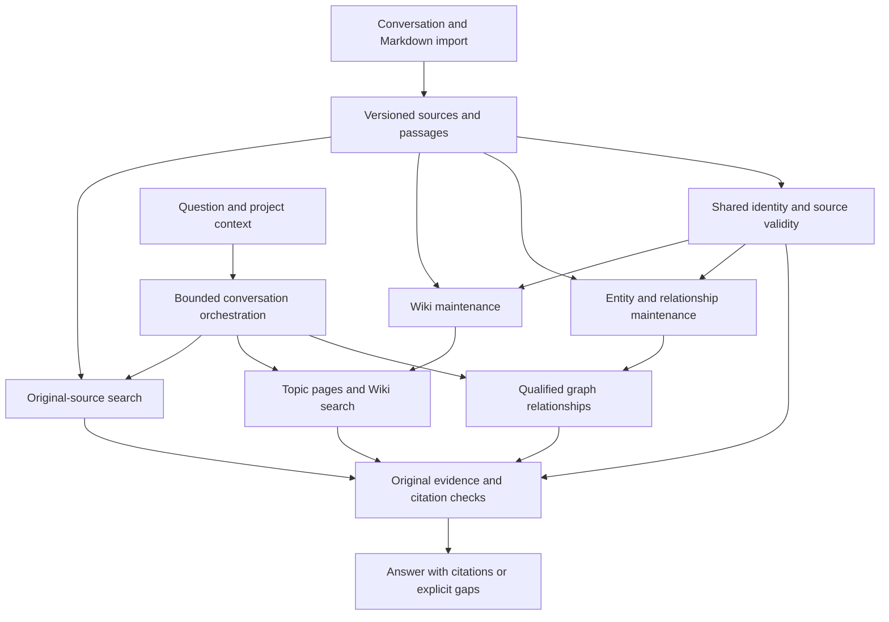

# LoreWeave: First-Version Construction Blueprint

Product name: **LoreWeave**. Repository slug: **`loreweave`**.
An agent-powered knowledge base with a living wiki, graph-assisted retrieval,
and source-backed answers. Naming is confirmed in
[Q40](rag-optimization-design.md#q40-product-and-repository-name).

Construction entry point, aligned on 2026-09-10. Start with the
[construction specification](https://github.com/L-1ngg/loreweave/issues/1), then the
[nine-module map](design/rag-v1/README.md) and
[17 delivery work items](../.scratch/rag-v1/README.md).
[Shared contracts](design/rag-v1/contracts.md) and module documents own callable
behavior; [alignment notes](design/rag-v1/alignment.md) record refinements made
while converting the discussion into a buildable plan. The D-series overview
below retains the design choices and points to those construction contracts.

Status: design only, 2026-09-10. The
[design discussion](rag-optimization-design.md) distinguishes user-confirmed
behavior from delegated choices: Q27 delegates evaluation, Q36 routine design,
Q37 component selection without compatibility or reuse constraints, and Q38
Forge Agent reuse/reference with upstream issue reporting and local fixes.
The D-series choices below are assistant-selected defaults under these delegations,
not additional individual user confirmations. They are adjustable during design
and implementation. No product implementation, migration, deployment, or RAG
evaluation has been performed for this blueprint. The Forge reuse investigation
records fresh controlled upstream SDK tests, separate from My-RAG integration.

The [current architecture](architecture.md) and [contracts](contracts.md)
continue to describe the existing system. The accepted shared provenance and
built-in conversation decisions retain their rationale in
[ADR-0001](adr/0001-shared-wiki-graph-provenance.md) and
[ADR-0002](adr/0002-built-in-knowledge-conversation.md). Forge SDK reuse and the
resulting backend choice are owned by
[ADR-0003](adr/0003-forge-agent-sdk-and-bun-host.md).

## Product and information flow

Serve one organization's Markdown knowledge across shared material and multiple
projects. Members use conversation to import, update, correct, and ask about
material, and browse an automatically maintained topic Wiki. Original passages
support factual answers; Wiki organizes knowledge; the graph locates related
evidence. Global Search, image understanding, external document synchronization,
and fine-grained project visibility remain outside the confirmed first version.

## D01: Modules and infrastructure selected for the new workload

Select a TypeScript/Bun backend with Hono for the browser API, Forge Agent's
public SDK for execution, and PostgreSQL with pgvector for durable state and
retrieval. Use Drizzle with reviewed SQL migrations for relational persistence
and schema evolution. Select React, TypeScript, Vite, and Bun for a browser SPA.
This supersedes the earlier Python/FastAPI/SQLAlchemy default so Agent tools and
knowledge operations can share a runtime without a separate Agent service. These
choices serve the new workload and do not require old code or contract reuse.
Keep modules behind small interfaces; they need not be separate network services.

The construction split is M01 Access/scope, M02 Sources, M03 Entity identity,
M04 Graph, M05 Wiki, M06 Evidence/answers, M07 Agent Host, M08 Durable operations,
and M09 Product interfaces. Their owned interfaces and dependencies are in the
[module map](design/rag-v1/README.md). This refines the earlier broad Knowledge
maintenance and Conversation groupings without introducing separate services.

PostgreSQL owns document and page identities, effective-version pointers, entity
identity, qualified relationship records, provenance/dependencies, sessions,
operation records, jobs, and publication metadata. Store immutable original bytes,
decoded Markdown, Wiki versions, and derived artifacts there as well. The
20-million-character active-source baseline represents tens of megabytes of text,
although versions, chunks, vectors, and indexes add storage that must be measured.
With no first-version binary attachment ingestion, a separate object store is
not required. Keep artifact access behind the Source management interface so
larger future artifacts can move without changing citations.

Use PostgreSQL lexical full-text retrieval and pgvector semantic retrieval,
fused with RRF, over source and Wiki chunks distinguished by content type and
organization/project scope. Produce a separate lexical representation with
Chinese segmentation and preserved English/technical identifiers; PostgreSQL's
default tokenization alone is not a sufficient Chinese retrieval plan. Select a
Bun-compatible Chinese tokenizer with corpus-derived technical vocabulary during
dependency verification; test names, abbreviations, identifiers and mixed-language
queries before tuning. The earlier Python jieba package choice is superseded.
Do not modify original evidence text for tokenization. Measure filtered vector
recall and latency on the actual corpus before selecting ANN index parameters.

Store graph adjacency and source-supported claims in PostgreSQL and perform
bounded neighborhood queries there. This fits Q9's restricted traversal scope;
actual relationship density and traversal performance must be measured. Use a
PostgreSQL durable job queue with operation deduplication and leases, serviced by
a separate worker process. Keep interactive requests and background model work
independently scheduled.

| Candidate | First-version choice and reason |
| --- | --- |
| PostgreSQL + pgvector | Selected: one transactional store for source validity, graph claims, text/vector retrieval and jobs at the agreed initial scale |
| Elasticsearch | Deferred: richer lexical search is useful, but a second search store and synchronization are not justified before the selected baseline is tested |
| Neo4j or Microsoft GraphRAG package | Deferred: bounded source-backed adjacency queries do not currently require a specialized graph platform or community-report pipeline |
| S3/MinIO | Deferred: Markdown-only artifacts fit the initial relational storage model; reconsider for binary content or measured storage pressure |
| MinerU | Excluded from this version: direct Markdown parsing fulfills the confirmed input scope |
| Forge Agent SDK | Selected as a pinned source dependency: reuse the tested execution/session behavior, with My-RAG host policies and knowledge tools |

This is a workload-based design selection, not measured proof that PostgreSQL
meets all targets. If retrieval quality or graph latency fails the development
workload, compare alternatives before release. No existing provider integration,
endpoint shape, document ID scheme, or database layout has a compatibility veto.

## D02: Markdown and document identity

Accept UTF-8 Markdown, using CommonMark-style structure plus pipe tables and
fenced code blocks. Treat frontmatter as optional metadata; retain its original
text. Preserve original bytes, heading paths, lists, tables, and code. Normalize
line endings and indexing text in separate derived representations, never by
rewriting stored originals. Record passage offsets against a defined decoded
source representation and source version so citations are reproducible.

Use markdown-it for structure parsing with the selected table support.
Verify the exact pinned package behavior against the syntax cases during
implementation. Keep images as references and supplied textual descriptions.
Do not automatically fetch remote image content; render the text/link fallback. Sanitize rendered
Markdown and disable executable raw HTML.

Assign opaque stable document IDs independently of filename. Renaming does not
change identity. Explicit new-document intent creates a new identity even when
names match; update intent resolves an existing identity using conversation and
project context, asking only when ambiguous. Revision identity includes content
and processing provenance. Deduplicate retries using an operation key; a new
explicit request is not silently treated as a retry merely because text matches.

Chat correction requests remain distinct from file uploads. Persist the request,
actor and scope. An explicit factual contribution can be retained as an attributed
source note; an editing preference is maintenance guidance. Neither silently
overrides contradictory sources. This preserves natural-language corrections
without requiring a new Markdown upload for every request.

## D03: Source activation and stale-content exclusion

Prepare parsed passages, lexical fields and embeddings before changing a
document's effective-version pointer. Keep candidates ineligible for current
retrieval until activation succeeds. Until then, the old version remains
effective and the import shows processing or failure. Activate the prepared
searchable revision and enqueue maintenance in one PostgreSQL transaction.

Every derived publication carries a dependency manifest of source versions and
identity decisions. Retrieval checks candidate dependencies against authoritative
effective-version state, rather than trusting cached eligibility or cleanup.
Activation therefore makes obsolete support ineligible immediately, even before
all page labels or derived graph records have been refreshed. Other applicable
support for a claim is evaluated separately under Q6 and Q33.

For the first version, invalidate at source-version granularity. A small source
edit can temporarily invalidate all derived claims depending on that version,
including unchanged passages, until revalidation. This conservative default is
simpler than semantic change detection and may increase refresh work. Do not
infer that a changed source supersedes a separate source without evidence.

Queries record their evidence versions. Recheck those dependencies before final
delivery. If a relevant version changed during answering, attempt one evidence
refresh using an unused retrieval round within the remaining budget;
otherwise return a clear update-related
gap. Draft streaming output must not be presented as a completed validated
answer. Final delivery states which evidence versions were used; later source
changes do not retroactively alter the saved answer. Record the validation time;
this is not a guarantee that sources cannot change during network delivery.
The exact admission contract is owned by [C02/C05](design/rag-v1/contracts.md).

## D04: Background maintenance and publication

Source search, Wiki maintenance, and graph maintenance expose separate readiness
states. Source evidence can serve questions before the two derived forms finish.
Use retryable durable jobs keyed by source revision, operation, and processing
version. Retry transport failures with bounded backoff; do not replay mutations
as new operations. Old jobs cannot overwrite output based on newer sources.

Run Wiki and graph derivation from original material, sharing entity identity
and source references. A Wiki job may link existing entity identities, but graph
extraction does not use generated Wiki prose as primary evidence. Trigger work
from source or correction changes and explicit repair requests; coalesce pending
changes and revalidate dependencies before publication. Do not add routine full-
corpus regeneration in the first version.

Apply Q35 checks to candidate Wiki versions: deterministic reference/link checks,
source-version checks, and model-assisted support/qualifier/conflict review of
changed claims. Graph outputs undergo corresponding schema, source-support and
qualifier checks. Allow one initial generation and up to two repair attempts per
candidate operation. Persist failure details if repair is exhausted. Never mark
a failed refresh as ready or reactivate stale evidence as a fallback.

Store immutable candidate artifacts before committing publication metadata.
Publish a related page-edit set, its page pointers, aliases and dependencies in one database
transaction, conditional on the expected previous page/source versions. On a
conflict, replan against current state. Prepare Wiki search fields before
activation where available; a browsable publication awaiting embeddings may
temporarily lack semantic-search coverage. Retrieval validates published-version
pointers so old candidates cannot supply obsolete content. Missing fresh search
coverage falls back to sources.

Publish conflicts when they are explicitly represented with both sources. A
Q34 restoration may publish as visibly pending update if it references obsolete
material; its stale portions remain excluded from current answers. Automatic
checks are fallible and do not replace provenance or correction history.

## D05: Wiki identity, editing and restoration

Give each page a stable ID independent of title and navigation path. Store a
versioned Markdown body with topic/scope, source dependencies, entity links,
publication status, and edit-operation provenance. Prefer linking shared pages
over copying organizational guidance into every project page.

After a merge, retain the retired page ID as an entry pointing to the resulting
page. After a split, retain a navigation entry listing the resulting topics.
Version-specific references continue to resolve to their historical content;
do not redirect an old citation to unrelated current text. Give section anchors
stable identities where possible and fall back to the cited historical version
when no faithful current target exists.

Record a multi-page merge/split as one edit operation. Recovery creates a new
compensating edit set; it does not erase history. Check later edits before
restoration and preserve unrelated changes. If the requested recovery has
ambiguous content consequences, describe them for a focused user clarification.
All restored content follows Q34's current-source revalidation and preserves
the user's restoration rationale for future maintenance.

## D06: Entity and relationship records

Keep source mentions separate from canonical entity identities. Store aliases,
type, project/organizational scope, and the evidence behind identity resolutions.
Use exact reliable identifiers and explicit source equivalence before similarity
candidates. Unresolved candidates remain separate under Q31. Retain reversible
identity-resolution records so correcting a merge can reassign original mentions
and invalidate dependent pages/relationships without losing source history.

Start with people, teams, projects, systems/services, components, and concepts.
Use a small versioned relation vocabulary for responsibility, membership,
ownership, part-of, dependency, usage, and applicability. Preserve the source's
relation wording as well as the normalized type. If a statement does not fit,
retain it as source evidence rather than force it into a misleading edge; extend
the vocabulary deliberately when development cases justify it.

Each supported relationship records subject, predicate, object, direction,
source passage/version, project scope, and available qualifiers: effective time,
environment, planned/current/historical status, negation, conditions, and conflict
group. Missing qualifiers stay unknown. Planned or negated statements must not
be traversed as positive current-use assertions. Do not infer transitivity or
causation from a path. Preserve independently supported claims when evidence
differs, rather than overwriting a single edge with the newest text.

## D07: Retrieval and answer defaults

Search original text and Wiki topics concurrently for ordinary questions. Use
lexical and original-content semantic retrieval with rank fusion; generated
questions and contextual summaries are optional experimental retrieval fields,
not substitutes for original evidence. Initially use RRF ordering without an
additional reranker; compare reranking on development data before enabling it.
This is a redesign default, not a change to existing configuration.

For clear relationship questions, include graph retrieval in the initial round.
Start graph expansion from resolved entities and relevant predicates with a
two-hop limit per call, up to 50 distinct entities and 100 relationship claims.
Rank candidates for query relevance and gather their original support. Bounds
are configurable development defaults, not claims about optimal graph coverage.

Merge evidence across routes by source version and passage identity. Multiple
derived uses of one passage count once. Preserve competing applicable claims
and necessary neighboring context; Wiki summaries and graph paths cannot crowd
their source passages out of the final evidence budget. Allow up to 8,000
evidence tokens for ordinary questions and 16,000 for complex questions, reduced
when needed to fit the selected model's context and reserved output budget.

Explicit project scope remains a retrieval constraint. Within that scope, allow
references to applicable shared organizational material. Ask if identifying the
intended project/entity is necessary and unresolved; do not silently broaden a
project-specific request into all projects. Report when graph or maintenance
coverage limitations prevent a complete answer.

## D08: Conversation and execution budgets

Embed `@forge-agent/core/sdk` from a pinned Forge source snapshot behind the
Conversation module. Reuse its single execution loop, custom tool protocol,
session mechanics, cancellation, context management and events; My-RAG supplies
the knowledge tools, PostgreSQL storage adapter and product policies. Do not
register coding tools or build an autonomous sub-agent tree. Source management
owns document identity, versioning and mutation idempotency. Uploaded source
instructions are document content, not authority to execute operations. The same
business operations support the browser and external MCP clients.

The [Forge reuse investigation](research/forge-agent-reuse.md) owns the inspected
source baseline, package/patch import plan, lifecycle obligations and integration
gaps. The public SDK is not an npm release. Source adoption must include its
workspace dependencies, licenses, runtime provenance and required provider patch.

Persist conversation turns, selected project/document context, operation results,
and final answer source references in PostgreSQL. Use recent turns plus a bounded
summary when needed. Adapt Forge's session entries and selected leaf to durable
PostgreSQL storage with one active writer per conversation. Summaries resolve
conversational context and are never new source evidence. Reload current
source/operation state when executing a turn. On restart, resume durable jobs by
operation key; mark interrupted answer generation as interrupted and reconcile
known operation outcomes instead of replaying a write with a missing tool result.

| Budget | Ordinary questions | Complex relationship questions |
| --- | --- | --- |
| Confirmed user-facing timing | At least 95% complete within 15 seconds | 60-second total request budget |
| Assistant-selected hard cutoff | 30 seconds | 60 seconds |
| Maximum retrieval rounds, initial included | 2 | 3 |
| Reserved final-answer time within total | 8 seconds | 15 seconds |
| Maximum final-answer output | 1,500 tokens | 1,500 tokens |

A round may contain independent source, Wiki, and graph calls; provider retries
must still obey elapsed-time and call limits. Permit at most three pre-finalization
model requests in total, including task retries and any summaries, and one final
answer call with at most one validation retry within the same deadline. Override
Forge's default retry settings; enforce cumulative admission immediately before
model requests, with a minimal local SDK patch if needed. Event-consumer counters
alone are not a strict request gate. Stop retrieval before the reserved answer
phase and finalize through M06's tools-disabled grounded generation call, with
citations validated before delivery. [C05](design/rag-v1/contracts.md#c05-budgets-and-finalization)
owns this finalization contract; SDK exploration text is not the final answer.
Stop early on sufficient evidence and cancel outstanding work at the deadline.
If a complete supported answer cannot be delivered, return an explicit partial
or unavailable result and count the latency/quality outcome as specified by the
evaluation plan. Reserving time does not guarantee provider completion. Forge
abort/dispose waits for cooperative tools and started persistence; a timed-out
response must not be reported as proof that all underlying work has stopped.
Retain the execution slot/lease until settlement, as specified by
[C04](design/rag-v1/contracts.md#c04-three-independent-lifecycles).

Maintain a shared five-slot interactive work queue; internal waiting counts
toward request deadlines. Use one background model-work slot initially, yielding
new background calls when interactive calls need the available provider quota.
Cap waiting interactive requests at ten and reject further requests with a
retryable busy result. These are initial local scheduling defaults; quotas and
deployment resources must be verified. Record per-operation tokens and costs;
an actual currency cap depends on the later provider and spending decision.

## D09: Browser and organizational access

Provide a browser interface with conversation, shared/project Wiki navigation,
page/source reading, version history, and import/maintenance status. Allow natural-
language imports, revisions, corrections, and restoration requests; internal IDs
are not required user input. Show useful states such as processing, searchable,
pending update, conflict, and failed refresh without exposing job internals.

Require organization membership for access. Members can read organization-wide
material, contribute sources/corrections, and request Wiki restoration. An
administrator manages membership and service settings. This is basic organization
access, not project-specific visibility. Use administrator-created organization
accounts with password login, modern password hashing, and revocable server-side
sessions in secure cookies; defer SSO. External clients use revocable organization-
scoped API credentials with explicit operation grants. Validate these grants in
the same operation entry points used by the browser. Concrete credentials and
public exposure are deployment work, not effects of this document.

## D10: Validation and delivery sequence

Use the delegated [evaluation plan](rag-evaluation-plan.md), with its frozen
holdout, separate task categories, four comparison configurations, and maintenance
checks. The current baseline is 1,000 active Markdown documents, at most 20 million
source characters, and five concurrent requests. Corpus language and update
frequency are not yet measured facts; use Chinese and English development cases
initially and version the actual corpus manifest when available.

The [work-item map](../.scratch/rag-v1/README.md) replaces the earlier broad phase
list with 17 vertical slices and explicit blockers. Begin with the pinned SDK
browser/evidence-tool path, then add persistence, access and original sources.
Source answering unlocks separate Wiki, graph, MCP and evaluation work. Each
GitHub issue owns its acceptance criteria, status and blockers; the map provides
navigation to the same delivery slices.

Each slice must exercise its public module interfaces with meaningful failure
and recovery cases. No quality or latency target is claimed achieved by writing
this blueprint. Source-searchable and derived-refresh times are measured
separately; no unsupported ingestion-time promise is introduced.

## Decisions requiring concrete evidence or separate authorization

- Specific model/provider selection and production resources require available
  deployment constraints and measured candidates. Use separate configurable
  embedding, answering and maintenance model roles; keep a single typed provider
  interface with an OpenAI-compatible adapter initially. Pin an embedding model
  per index generation. Monetary commitments and credentials must be supplied
  before paid or production work; this blueprint incurs neither.
- Build the redesign with a fresh schema and new contracts; compatibility and
  old-data migration are not requirements under Q37. Existing data may remain
  untouched outside the new system. Any later cutover, archival/deletion or
  requested data transfer needs a concrete execution plan before acting on it.
- Starting implementation remains a separate step from this design delegation.
  Prepare changes in bounded slices once authorized; do not interpret delegated
  routine design as approval to deploy or replace the current system.

Remaining reversible details such as exact dependency versions, schema migrations
and tool payloads should be resolved during implementation preparation against
this design, without another round of routine interviews.
