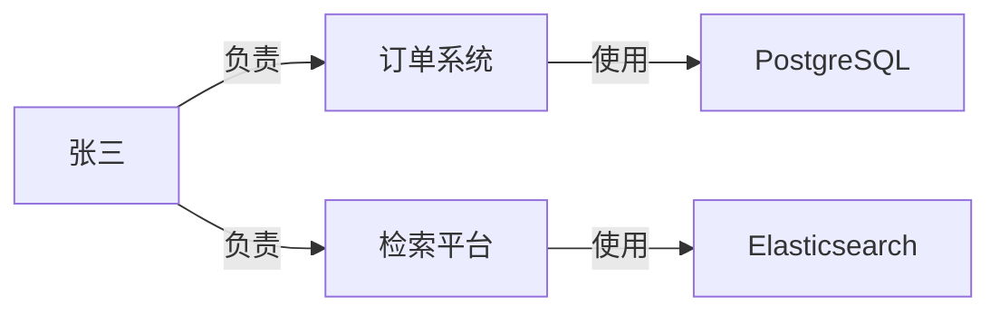

# GraphRAG 中文入门

> 文档类型：基于官方文档与本轮讲解整理的中文入门说明，非单篇原文的逐字译文。  
> 整理日期：2026-09-09  
> 主要参考：[Microsoft GraphRAG 官方文档](https://microsoft.github.io/graphrag/)。  
> 配套阅读：[LLM Wiki 中文译文](llm-wiki.zh-CN.md)。

## 核心想法

**GraphRAG 把资料中的对象及其关系组织起来，检索时利用这些关系寻找证据，再让 LLM 回答。**

GraphRAG 泛指一类图增强检索方法。经常被讨论的 **Microsoft GraphRAG** 是其中一个具体实现，它还加入了社区划分、社区摘要等机制。

理解 GraphRAG 可以先从三个概念开始：

- **实体（Entity）**：可以被识别和讨论的对象，例如人、项目、组织、技术组件，对应图中的节点。
- **关系（Relationship）**：对象之间的联系，例如“负责”“使用”“属于”，对应图中的边。
- **多跳检索（Multi-hop retrieval）**：沿着多段关系寻找相关信息，例如从人找到项目，再从项目找到使用的技术。

这些节点和边组合起来，就是一种知识图谱（Knowledge Graph）。不同实现对实体、关系及其属性的表示方式可以不同。

## 一个具体例子

假设知识库有三份文档：

| 文档 | 内容 |
| --- | --- |
| 人员安排 | 张三负责订单系统和检索平台 |
| 订单系统设计 | 订单系统使用 PostgreSQL 保存业务数据 |
| 检索平台设计 | 检索平台使用 Elasticsearch 建立搜索索引 |

用户提问：

> 张三负责的项目分别使用了哪些存储或检索组件？

回答需要把三份文档的信息连接起来。

普通向量检索可以尝试找齐相关片段，但问题中没有出现 PostgreSQL 或 Elasticsearch。系统需要跨越“人 → 项目 → 技术组件”这几层联系，才能组织出完整答案。

图谱可以显式保存这些联系：



这里用带标签的箭头帮助理解。实际图谱实现也可能把关系类型、条件等信息保存在关系描述或属性中。

## 准备资料：从原文建立图

构建图谱时，系统需要从原文抽取实体和关系，并保存来源。例如：

```text
张三 —负责→ 订单系统
来源：人员安排，第 2 节

订单系统 —使用→ PostgreSQL
来源：订单系统设计，第 4 节
```

除了抽取关系，还需要处理身份问题：

- “张三”和“Zhang San”是否是同一个人？
- “订单系统”和“订单服务”是否指同一个系统？
- 两个不同项目中的“用户服务”是否只是名称相同？

这些问题通常涉及实体消歧与合并。如果处理错误，关系可能连接到错误对象，或者本来相同的对象被拆成多个节点。

图谱中的信息仍然需要关联原文。Microsoft GraphRAG 的实体和关系记录包含 `text_unit_ids`，可以关联到原始文本片段，再通过文本片段找到对应文档。实体描述、关系描述和社区摘要则可能由模型生成。

**有来源映射，意味着具备追溯的基础；它不自动证明每条抽取结果都正确。**

## 回答问题：利用关系寻找证据

对于“张三负责的项目分别使用哪些组件”，一个简化的检索过程是：

1. 从问题中找到“张三”这个入口。
2. 沿“负责”关系找到订单系统和检索平台。
3. 沿“使用”关系找到 PostgreSQL 和 Elasticsearch。
4. 取回这些关系关联的原文。
5. 让 LLM 根据证据组织答案并提供引用。

从“张三”经过“项目”到达“组件”，沿关系走了两步，这就是多跳检索的直观例子。

LLM 可以负责理解问题、抽取信息和组织答案；沿边查找关联对象，也可以由普通程序完成。GraphRAG 不要求每一步都由模型自由推理。

这个例子用于解释基本思路，并不表示 Microsoft GraphRAG 总是把自然语言问题翻译成固定的两跳图查询。它的实际检索流程还会结合向量匹配、关系信息、文本片段和上下文预算。

## Microsoft GraphRAG 的 Local Search 与 Global Search

这两种方式解决的问题不同。

| 方式 | 如何寻找信息 | 适合的问题 |
| --- | --- | --- |
| **Local Search** | 从问题相关的实体出发，收集关系、相关原文和社区信息 | “张三负责哪些项目？这些项目使用什么技术？” |
| **Global Search** | 利用覆盖资料集的社区摘要，分批分析后汇总 | “整个公司的技术选型有哪些共同特点？” |

### Local Search：围绕相关实体寻找细节

前面的例子接近 Local Search 的思路。

Microsoft GraphRAG 会先找出与问题语义相关的实体，以这些实体作为进入图谱的入口，再收集相连的实体、关系、社区报告，以及关联的原始文本片段。

这些候选信息经过优先级排序和过滤，被组织进预先设定大小的上下文窗口，供模型生成回答。

因此，Local Search 不只是“查图”：它把图结构与原文检索结合起来使用。

### Global Search：理解整批资料

假设知识库中有几百份项目文档，用户想知道整体技术趋势。此时，围绕某一个实体向外查找，未必能覆盖整个资料集。

Microsoft GraphRAG 会把联系较紧密的实体划成 **社区（Community）**，并为这些社区生成报告。社区可以有层级：较大的社区覆盖更广的范围，较小的社区呈现更细的结构。

这里的社区是图中的结构分组，不一定对应真实部门，也不一定对应人工编写的 Wiki 主题。

Global Search 使用这些社区报告回答问题：

1. **Map 阶段**：分批读取社区报告，生成与问题相关的中间回答。
2. **Reduce 阶段**：筛选并汇总重要内容，形成最终答案。

所选社区层级会影响回答的细致程度和资源消耗。更细的社区通常意味着需要处理更多报告；官方文档明确指出，全局搜索可能需要较多时间与 LLM 资源。

Microsoft GraphRAG 还提供 DRIFT Search 和 Basic Search。入门时可以先掌握 Local 与 Global 的区别，再进一步学习其他方式。

## 图谱能提供什么，以及它不能自动解决什么

图谱的价值，在于把分散的关联显式保存下来，让系统能够沿关系查找证据，或者利用社区信息理解更大范围的内容。

它不会自动保证知识正确，也不会自动解决版本冲突。

例如，旧文档说订单系统使用 MySQL，新文档说已经迁移到 PostgreSQL。如果抽取时丢掉时间和版本，图里可能同时存在两条“使用”关系，最终答案就会混淆现状和历史。

因此，一个可靠系统还需要保留或管理：

- 关系来自哪段原文。
- 它适用于哪个时间、版本或条件。
- 不同来源是否存在尚未解决的矛盾。
- 原始资料变化后，哪些关系和摘要需要重新检查。

图上的路径也不一定能直接证明某个结论。例如：

```text
系统 A 依赖服务 B
服务 B 依赖数据库 C
```

这条路径可以提示我们调查数据库 C 对系统 A 的影响，但还不能直接断言“C 故障必然导致 A 故障”。缓存、降级和备用路径都可能改变结论，需要回到资料中核实。

## 与 LLM Wiki 的联系

| 维度 | LLM Wiki | GraphRAG |
| --- | --- | --- |
| 主要关注 | 怎样持续整理、维护和积累知识 | 怎样利用图结构组织和检索证据 |
| 典型组织形式 | 主题页面、实体页面、比较分析与交叉链接 | 实体、关系、来源映射，以及可能存在的社区摘要 |
| 主要使用方式 | 阅读页面、沿链接浏览、查询并沉淀成果 | 从相关实体扩展检索，或利用社区信息回答全局问题 |
| 共同基础 | 需要保留原始资料和出处 | 需要保留原始资料和出处 |

Wiki 擅长把知识整理成可阅读的页面；GraphRAG 擅长把关系用于检索，并连接分散的证据。

两者可以结合，也可以独立使用。Wiki 页面之间有链接，可以作为理解图的入口，但不意味着已经实现了 GraphRAG。GraphRAG 也不要求先建立一套 Wiki。

## 参考资料

- [Microsoft GraphRAG：查询概览](https://microsoft.github.io/graphrag/query/overview/)
- [Microsoft GraphRAG：Local Search](https://microsoft.github.io/graphrag/query/local_search/)
- [Microsoft GraphRAG：Global Search](https://microsoft.github.io/graphrag/query/global_search/)
- [Microsoft GraphRAG：输出数据结构](https://microsoft.github.io/graphrag/index/outputs/)
- [Karpathy：LLM Wiki 原文](https://gist.github.com/karpathy/442a6bf555914893e9891c11519de94f)
- [LLM Wiki 中文译文](llm-wiki.zh-CN.md)
